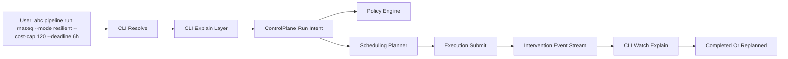
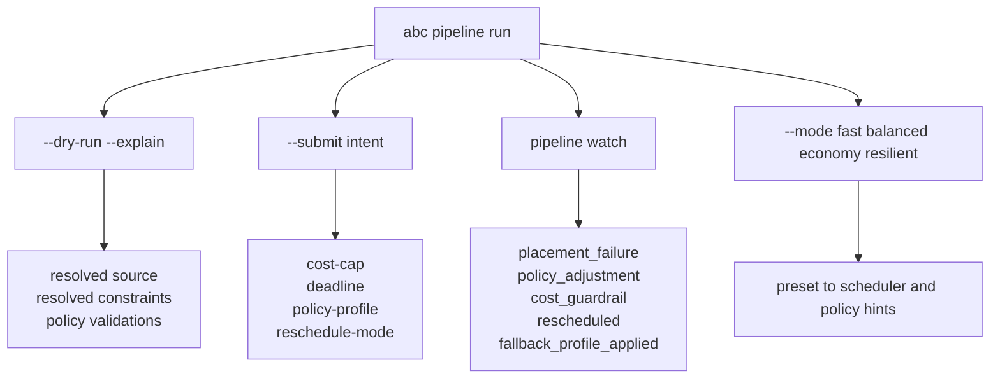
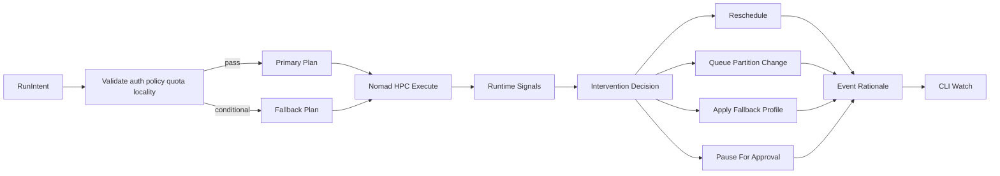
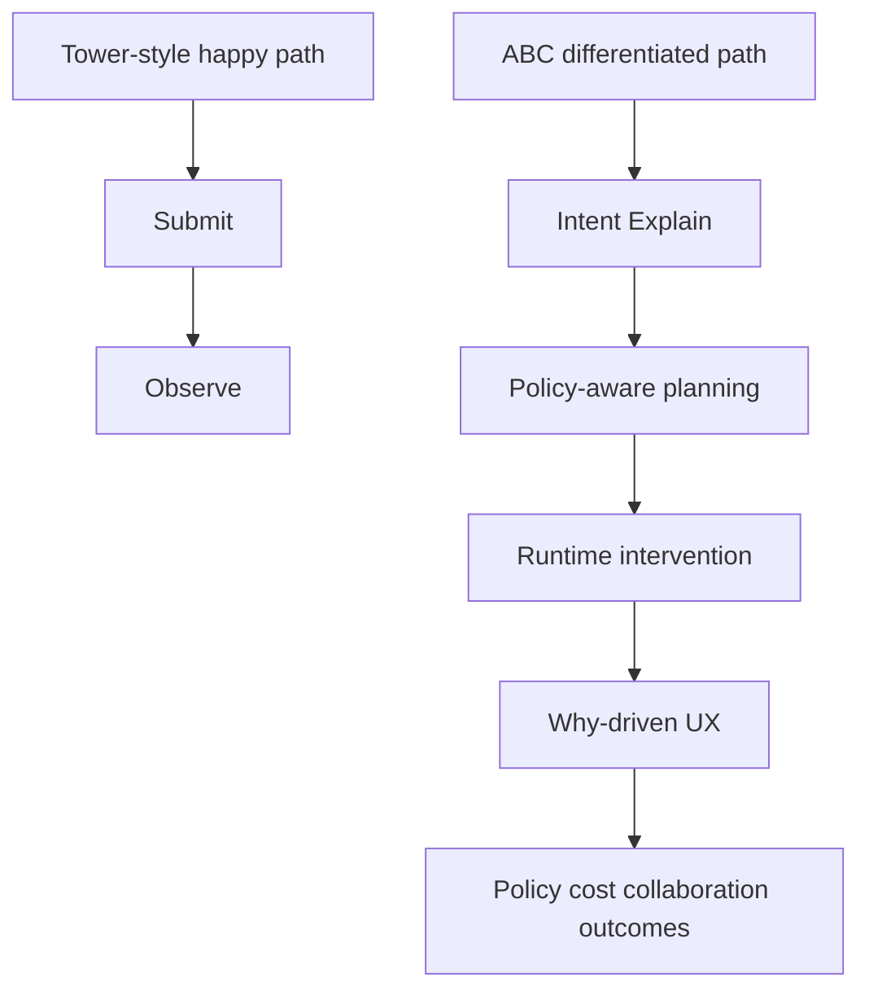

# `abc` CLI — Command Design Specification v7

> **Purpose:** Authoritative specification of the `abc` CLI as implemented after the v6 iteration.
> Documents every command group, subcommand, flag, expected output, and stub state.
> An AI agent reading this document can understand the current CLI surface and what is implemented
> vs stubbed for future work.
>
> Codebase: `github.com/abc-cluster/abc-cluster-cli`
> Design epoch: 2026-04-16 (config: Nomad under `admin.services.nomad`; see §0.4, §0.7–§0.8, §5, §6)

---

## 0. What Changed from v6 → v7

### 0.1 Implemented from v6 spec

| Change | Status | File(s) |
|--------|--------|---------|
| Remove `--conda`/`--pixi`/`--tool-arg` from `abc submit` | ✅ Done | `cmd/submit/cmd.go`, `detect.go`, `submit.go` |
| Add `#ABC --pixi` preamble directive to job scripts | ✅ Done | `cmd/job/directive.go`, `cmd/job/jobspec.go` |
| Rename `abc cost` / `abc budget` → **`abc accounting`** (aliases retained) | ✅ Done | `cmd/accounting/cmd.go`, `cmd/root.go` |
| Create `abc infra` group (node, storage) | ✅ Done | `cmd/infra/cmd.go` |
| Remove top-level `abc node` and `abc storage` | ✅ Done | `cmd/root.go` |
| Add `--user <email>` global flag + `X-ABC-As-User` header | ✅ Done | `cmd/root.go`, `cmd/utils/nomad_client.go`, `cmd/utils/util.go` |
| Create `abc admin` group with `services` and `app` subgroups | ✅ Done | `cmd/admin/cmd.go` |
| Move `abc service` → `abc admin services` | ✅ Done | `cmd/root.go` |
| Move `abc namespace` → `abc admin services nomad namespace` | ✅ Done | `cmd/admin/cmd.go` |
| Expand service health list (xtdb, supabase, tailscale, khan) | ✅ Done | `cmd/service/cmd.go` |
| Add `--ssh`/`--ssh-timeout` flags to `abc job run` | ✅ Done | `cmd/job/run.go` (stub) |
| Add `--with-data`/`--with-jobs` flags to `abc pipeline delete` | ✅ Done | `cmd/pipeline/delete.go` (stubs) |
| Add `abc infra compute probe` stub | ✅ Done | `cmd/compute/probe.go` |
| Add `abc job trace` stub | ✅ Done | `cmd/job/trace.go` |
| Add `abc pipeline params` stub | ✅ Done | `cmd/pipeline/params.go` |
| Restore `abc auth` command group | ✅ Done | `cmd/auth/cmd.go` |
| Restore `abc config` command group | ✅ Done | `cmd/config/cmd.go` |
| Add `abc secrets` command for managing encrypted credentials | ✅ Done | `cmd/secrets/cmd.go` |
| Config file location: `$HOME/.abc/config.yaml` | ✅ Done | `internal/config/config.go` |

### 0.5 abc-nodes Integration (post-v7)

The following features were implemented after the v7 epoch to support **`cluster_type: abc-nodes`** contexts:

| Change | Status | File(s) |
|--------|--------|---------|
| `abc cluster capabilities sync` — query Nomad service registry, fall back to job listing on 403, populate `capabilities.*` and `admin.services.*` in config | ✅ Done | `cmd/cluster/capabilities.go`, `internal/config/capabilities.go` |
| `abc cluster capabilities show` — print stored capabilities for active context | ✅ Done | `cmd/cluster/capabilities.go` |
| `abc secrets --backend nomad` — store/get/list/delete secrets in Nomad Variables (`abc/secrets/<ns>/<name>`) | ✅ Done | `cmd/secrets/nomad_backend.go` |
| `abc secrets --backend vault` — store/get/list/delete secrets in Vault KV v2 (`secret/data/abc/<ns>/<name>`) | ✅ Done | `cmd/secrets/vault_backend.go` |
| `abc secrets ref KEY --backend nomad|vault` — print Nomad template HCL snippet (no plaintext) | ✅ Done | `cmd/secrets/cmd.go` |
| `abc secrets backend setup --backend nomad` — create `abc-secrets-alloc-read` ACL policy | ✅ Done | `cmd/secrets/nomad_backend.go` |
| `abc data upload` abc-nodes tusd fallback: auto-use `admin.services.tusd.http/files/` when `capabilities.uploads == true` | ✅ Done | `cmd/data/upload_resolve.go` |
| `abc pipeline run` `secret://name` param translation: rewrite to nomadVar/vault template ref before HCL generation | ✅ Done | `cmd/pipeline/run.go` |
| `vault.nomad.hcl` Raft integrated storage: durable Vault with data at `/opt/nomad/vault/data` | ✅ Done | `deployments/abc-nodes/nomad/vault.nomad.hcl` |
| `nomadClientForCapabilities()`: bypass cloud-gateway env vars (`ABC_ADDR`/`NOMAD_ADDR`) for abc-nodes Nomad access | ✅ Done | `cmd/cluster/capabilities.go` |
| `cfg.ResolveContextName()` alias fix in capabilities sync: write to canonical context name, not alias, to prevent `Save()` collision | ✅ Done | `cmd/cluster/capabilities.go` |

### 0.6 Planned Nomad namespace: `applications`

ACL and operations docs describe a future **`applications`** Nomad namespace for **cross-group platform jobs** (e.g. **GVDS**, **BRIMS**) — separate from **`services`** (abc-nodes floor) and from **`su-mbhg-*`** research namespaces. Rollout steps, policy sketch, and priority notes live in **`deployments/abc-nodes/acl/ACCESS_POLICY_PLAN.md`** (*Planned: `applications` namespace*). The CLI already supports arbitrary `nomad_namespace` / `admin.whoami` derivation per context; no code change is required to *use* the namespace once it exists in Nomad.

### 0.2 Structural decisions

- **Aliases:** `abc accounting` is canonical for cloud spend / namespace caps; `abc cost` and `abc budget` remain **aliases**. Other old names (`abc node`, `abc namespace`, `abc service`) have been removed cleanly without backward-compat shims.
- **`abc admin app`** subgroup holds application-level entity management (workspace, organization).
  This is extensible: new entity types are added as subcommands under `app`.
- **`abc admin services`** holds service health checks (ping, version) and Nomad operations that are
  directly relevant to the ABC-cluster platform. Organized as: `abc admin services ping`,
  `abc admin services version`, `abc admin services cli setup`,
  `abc admin services nomad node <subcommand>`, and `abc admin services nomad cli -- <nomad-args...>` (verbatim passthrough after `--`; `cli setup` is handled by abc).
  The `cli` subcommand is a preconfigured passthrough alias to the local Nomad CLI for operations
  that abc does not yet implement natively.
  The porcelain wrapper `abc admin services cli setup` bootstraps all wrapped binaries (`nomad`,
  `abc-node-probe`, `tailscale`) into `~/.abc/binaries` (future: config/env override path).
  **Note:** The goal is not to provide full-fledged API clients or duplicate existing service APIs,
  but to build just enough functionality to test our use-cases for the ABC-cluster platform.
- **`abc infra`** holds infrastructure operations (node, storage).
- **Stubs** are real cobra commands that return `"not yet implemented"`. They appear in help, are
  discoverable, and give the right shape for future implementation.
- **Config file versioning** — The config file at `~/.abc/config.yaml` includes a `version` field
  for schema evolution. Currently at v1. Future versions (v2, v3) will support automated migrations
  if the structure needs to change. Configs without a version field default to v1.

### 0.3 Next Iteration Tracking (Planned)

The following items are explicitly tracked for the next iteration:

| Item | Scope | Target |
|------|-------|--------|
| Extend structured output contract | `infra compute probe` | Add `--output table|json` and `--json-path` for dispatch/probe result metadata |
| Extend structured output contract | `job list`, `job show`, `job status` | Standardize `--output table|json` and path-filtered JSON output |
| Shared output utility hardening | `cmd/*` common helpers | Promote reusable output helper package and unify error semantics |
| JSON path capabilities | Structured output layer | Evaluate richer JSONPath support (quoted keys, filters) vs current lightweight parser |
| Regression coverage | tests | Add command-level tests for output mode matrix (`table`, `json`, `json-path`) |

Non-goal for this tracking item:
- Replacing table UX defaults; table remains the default human-readable mode.

### 0.4 Config-Backed Nomad Access

The active abc config context is the source of truth for node-specific Nomad connectivity so `abc job`, `abc pipeline`, and `abc submit` work without ad-hoc `--nomad-addr` / `--nomad-token` when those flags (and `ABC_*` / `NOMAD_*` env overrides) are absent.

| Item | Scope | Behaviour |
|------|-------|-----------|
| Save Nomad connection details | `abc infra compute add` | Persist **`nomad_addr`**, **`nomad_token`** under **`contexts.<name>.admin.services.nomad`** on the active context |
| Optional Nomad RPC region | Config / flags / env | **`nomad_region`** under the same block, or `--region` / `NOMAD_REGION` — **not** `contexts.<name>.region` (ABC / workspace label) |
| Resolve Nomad defaults | `abc job`, `abc pipeline`, `abc submit`, `abc admin services nomad cli` | Use `admin.services.nomad.*` when flags and env are absent |
| Fallback for unsupported Nomad operations | Passthrough | Invoke the local `nomad` CLI with the same resolved address, token, and optional Nomad RPC region |

Fallback policy:

- If abc already implements the operation, use the native implementation.
- If the operation is Nomad-specific and not yet implemented, invoke the local `nomad` CLI using **`admin.services.nomad`** (`nomad_addr`, `nomad_token`, optional **`nomad_region`**). Bare `http://host` for `nomad_addr` is normalized to **`http://host:4646`** before calls.
- This keeps developer workflows moving while native coverage catches up.

### 0.6 XTDB, auditing, and tier boundaries (design note)

This subsection records **agreed platform direction** (2026): where persistent *audit* belongs vs operational logs, and why the **`abc` CLI / abc-nodes (OSS-1)** layer should not host XTDB as the primary audit store.

**Authoritative reference:** the ABC Cluster platform vision (working draft: *ABC Cluster — Platform Vision*, `abc-cluster-vision.md`) defines three tiers — **OSS-1 (abc-node)**, **OSS-2 (abc-cluster)**, **Commercial (abc-cloud)** — and what each deliberately includes or omits.

| Concern | OSS-1 (abc-nodes + CLI) | OSS-2 onward (Khan + Jurist + …) |
|--------|-------------------------|-----------------------------------|
| **Operational forensics** | **Grafana Loki** (allocation logs), **Prometheus**, Nomad API, optional ntfy — sufficient for Server Manager / Bioinformatician / PI personas at this tier. | Same signals plus control-plane logs in Loki; cross-component drill-down in Grafana. |
| **Grant-auditable / policy decision trail** | **Out of scope by design** — vision explicitly places compliance personas (audit trails, policy enforcement, cross-institutional access) **above** OSS-1. | **XTDB** — bitemporal **decisions**, **CloudEvents**, cost transfers, lineage, OPA policy snapshots, etc.; **Jurist** performs OPA evaluation, mutation, and **XTDB audit logging**; **Khan** is the admission edge. |

**Why not integrate XTDB “from the CLI / Nomad-only path” first**

1. **Scope before features** — OSS-1 must remain **functionally complete without a control plane**; adding XTDB to every abc-nodes lab raises state, backup, and upgrade burden without Khan/Jurist semantics.
2. **Single writer of record** — If the CLI or a raw Nomad-side job writes audit rows while **Jurist** is later defined as the writer of **admission decisions**, you risk **two sources of truth** and expensive reconciliation.
3. **Separation of concerns** — **Loki** answers “what did the task print / what did the agent ship?” **XTDB** answers “what did the *platform* decide, under which policy version, for which subject, at which valid time?” Those are different products in the vision.

**Preferred incremental path**

- **OSS-1:** keep strengthening **Loki + metrics + Nomad metadata** (operational persistence and search).
- **OSS-2 thin vertical:** emit **one or two CloudEvent-shaped facts** from **Khan or Jurist** into XTDB (same envelope the vision describes for the commercial event system), proving schema and queries before widening scope.
- **CLI role:** when a control plane exists, the CLI should **call Khan** for admission-backed actions; it should not become a parallel XTDB client for policy-adjacent events in place of Jurist.

**Non-goal:** presenting OSS-1 + XTDB as **grant-auditable** without the full OSS-2 admission chain — that would contradict the tier boundary in the vision document.

### 0.7 User-facing credentials: “one token” vs what abc-nodes can do today

This subsection records **design intent** for **group members** and **group admins** who want a **single human entry point** to everything allocated to them, and how that relates to **machine credentials** on **OSS-1 (abc-nodes)** vs **OSS-2 (`abc-khan-svc` and friends)**.

**What “one token” should mean (target semantics)**

- **One human credential** — typically **IdP sign-in + MFA** and/or a **short-lived session** at a portal or the CLI — that **gates** issuance of **scoped, short-lived** secrets for each subsystem.
- It does **not** mean one **long-lived** string that is pasted into Nomad, S3, Vault, and every browser flow “because it is simpler.” That pattern maximizes **blast radius** and bypasses least-privilege boundaries.

**Reality on abc-nodes today (OSS-1)**

- **Nomad ACL**, **object storage (MinIO/S3)**, **edge upload (Traefik/tusd)**, **Vault**, and the **`abc` CLI** each expose **different auth shapes** (tokens, keys, headers, paths). Capabilities sync and config (§0.4, §0.5) reduce **wiring friction** but do not merge those planes into a single secret.
- A **Nomad ACL token** is a **scheduler / cluster API** credential. It is **not** a good substitute for a **browser identity** or a **data-plane object-store principal** for every persona — especially where the goal is to limit who can **dispatch**, **read secrets**, and **reach raw APIs**.

**What is feasible without a control-plane broker**

- **Tighten audience:** only **cluster admins** who operate the floor should hold **raw Nomad / Vault / observability** credentials; **group members** use the **`abc` CLI** for day-to-day work (§0.8). **Browser** use for members is intentionally **narrow** — see §0.8 — not “every dashboard the cluster runs.”
- **Automation** uses **service accounts** and **narrow policies**, not shared human tokens.
- **Naming and mirroring** (consistent namespaces, labels, URLs) reduce **operator confusion**; they do **not** reduce **secret count** unless humans **never** receive downstream keys.
- **Caddy/Auth gateway pattern (OSS-1 bridge):** Caddy (including auth plugins such as `authcrunch`) can enforce a single browser entry credential (for example a Nomad ACL token) and call a forward-auth service to validate it. However, this is still a **gateway pattern**, not full credential unification: mapping that Nomad identity to MinIO/tusd rights requires a token-exchange/identity service that issues scoped downstream access (preferably short-lived), rather than forwarding one long-lived Nomad token to every backend.

**What requires OSS-2 (Khan-aligned admission)**

- **True** “issue me everything I am allowed to touch” from **one identity** needs a **broker** that maps **subject + role** → **policies** → **scoped** Nomad, storage, Vault, and future API credentials. That is the role envisioned for **`abc-khan-svc`** (admission edge) with **Jurist** / **XTDB** for decisions where the vision applies — not a feature bolted onto the CLI alone.

**Design tension to preserve explicitly**

- A **single powerful Nomad token** “for everything” is **simple to document** but **unsafe** and **misaligned** with tier boundaries (§0.6).
- The **preferred** pattern is **session (or CLI login) + exchange** for **short-lived, purpose-scoped** credentials, with **raw cluster tokens** reserved for **break-glass** and **automation** with clear ownership.

**Non-goals**

- Promising **OSS-1** users a **fully unified token vault** with **central audit** of every issuance — that belongs to **OSS-2** per `abc-cluster-vision.md`.
- Encouraging **one Nomad ACL token** as the **only** credential researchers carry for **data upload**, **secrets**, and **job control** without an admission layer.

### 0.8 OSS-1 access surface: CLI-first members, portal access for cluster admins

This subsection records the **intended operator vs researcher experience** on **abc-nodes (OSS-1)** — what should be documented in runbooks and how **URLs** are presented to each persona.

**Group members (researchers, pipeline users)**

- **Primary surface:** the **`abc` CLI** — jobs, pipelines, data movement, secrets references, and workspace-oriented flows **without** expecting a web console for Nomad, Grafana, Vault, etc.
- **Browser exceptions (by design):** workflows that genuinely need a **web object UX** — the **MinIO** (or compatible S3) **console** / bucket UI as deployed, and the **tusd** upload path with **Uppy** (or equivalent) where large or resumable uploads are driven from the browser. Those portals are **data-plane** entry points, not substitutes for the full cluster control plane.
- **Non-goal:** training every member to bookmark **Nomad UI**, **Grafana**, **Loki Explore**, **Vault UI**, **Traefik dashboard**, and similar — those remain **operator tools** unless OSS-2 adds an institutional console.

**Cluster admins (platform / lab operators)**

- **Hold the relevant credentials** (Nomad ACL, MinIO root or admin keys where policy allows, Grafana stack auth, Vault bootstrap tokens or policies, service registry URLs, etc.) per **`abc infra compute add`**, **`abc admin services`**, and deployment runbooks.
- **May use all service portals** the floor exposes — Nomad, observability, Vault, object store, upload edge, Traefik — for provisioning, debugging, and incident response. This is **explicitly in scope** for the **cluster-admin** / **sudo** tier (§2) in documentation and ACL planning (`deployments/abc-nodes/acl/`).

**Why this split**

- Reduces **credential sprawl** for members: they do not need scheduler or observability logins for routine science work.
- Keeps **blast radius** aligned with roles: powerful tokens and dashboard access stay with people who accept operational responsibility for the node.

---

## 1. Global CLI Flags

All flags are defined as persistent flags on the root command and available on every subcommand.

| Flag | Env var | Description | Default |
|------|---------|-------------|---------|
| `--url` | `ABC_API_ENDPOINT` | ABC control-plane API endpoint URL | `https://api.abc-cluster.io` |
| `--access-token` | `ABC_ACCESS_TOKEN` | User access token | *(unset)* |
| `--workspace` | `ABC_WORKSPACE_ID` | Workspace ID | *(user's default)* |
| `--nomad-addr` | `ABC_ADDR` / `NOMAD_ADDR` | Nomad API address | `http://127.0.0.1:4646` |
| `--nomad-token` | `ABC_TOKEN` / `NOMAD_TOKEN` | Nomad ACL token | *(unset)* |
| `--region` | `ABC_REGION` / `NOMAD_REGION` | Nomad **RPC** region (e.g. `global`). Distinct from `contexts.<name>.region` (ABC label). | *(unset)* |
| `--cluster` | `ABC_CLUSTER` | Target a specific named cluster | *(unset)* |
| `--sudo` | `ABC_CLI_SUDO_MODE` | Elevate to cluster-admin scope | `false` |
| `--cloud` | `ABC_CLI_CLOUD_MODE` | Elevate to infrastructure scope | `false` |
| `--user <email>` | `ABC_AS_USER` | Act on behalf of another user (admin only) | *(unset)* |
| `--exp` | `ABC_CLI_EXP_MODE` | Enable experimental features | `false` |
| `--quiet` / `-q` | | Suppress informational stderr output | `false` |
| `--debug[=N]` | `ABC_DEBUG` | Structured JSON debug log (0=off, 1–3=increasing verbosity) | `0` |

### HTTP Headers sent to the control plane

| Condition | Header |
|-----------|--------|
| `--nomad-token` set | `X-Nomad-Token: <token>` |
| `--sudo` | `X-ABC-Sudo: 1` |
| `--cloud` | `X-ABC-Cloud: 1` |
| `--user <email>` | `X-ABC-As-User: <email>` |

---

## 2. Elevation Tiers

| Tier | Flag | Scope | Required for |
|------|------|-------|-------------|
| 0 — user | *(none)* | Own namespace, own jobs | `submit`, `pipeline`, `job`, `data`, `module` |
| 1 — cluster-admin | `--sudo` | Namespace-wide or cluster-wide | `admin services nomad namespace create/delete`, `infra compute add/drain` |
| 2 — infrastructure | `--cloud` | Fleet-wide, cloud provider APIs | `cluster provision/decommission`, `accounting set` |
| 3 — impersonation | `--sudo --user <email>` | Acts as another user | Admin only — sends `X-ABC-As-User` |

---

## 3. Command Tree (v7 — implemented)

```
abc
│
│  ── Authentication & Configuration ─────────────────────────────────────
├── auth
│   ├── login           Interactive login — prompts for endpoint + token
│   ├── logout          Clear the active session
│   ├── whoami          Show the current authenticated identity
│   ├── token           Print the access token (pipe-safe)
│   └── refresh         Refresh the access token (stub)
│
├── config
│   ├── init            Initialize configuration interactively
│   ├── set    KEY VALUE               Set a configuration key
│   ├── get    KEY                     Get a configuration key
│   ├── list                           List all configuration keys
│   └── unset  KEY                     Unset (clear) a configuration key
│
├── secrets                                  [--backend local|nomad|vault] [--namespace <ns>]
│   ├── init   --unsafe-local               Generate local crypt defaults
│   ├── set    KEY VALUE                     Store a secret (local: requires --unsafe-local)
│   ├── get    KEY                           Retrieve a secret
│   ├── list                                 List stored secret keys
│   ├── delete KEY                           Delete a secret
│   ├── ref    KEY                           Print Nomad template HCL snippet (no plaintext)
│   └── backend
│       └── setup                            Create Nomad ACL policy for alloc read access
│
│  ── Unified entry point ────────────────────────────────────────────────
├── submit       <target> [flags]                (auto-detects pipeline/module/job)
│
│  ── Pipeline management ────────────────────────────────────────────────
├── pipeline
│   ├── run      <name-or-url> [flags]
│   ├── add      <repository> [flags]
│   ├── list
│   ├── info     <name>
│   ├── update   <name> [flags]
│   ├── delete   <name> [--yes] [--with-data] [--with-jobs]
│   ├── export   <name> [output-file]
│   ├── import   <file> [flags]
│   └── params   <name> [--auto-latest]          (stub)
│
│  ── Module management ───────────────────────────────────────────────────
├── module
│   └── run      <nf-core/module> [flags]
│
│  ── Job management ──────────────────────────────────────────────────────
├── job
│   ├── run      <script> [flags]
│   ├── translate <script> [flags]
│   ├── list     [flags]
│   ├── show     <job-id> [flags]
│   ├── stop     <job-id> [flags]
│   ├── logs     <job-id> [flags]
│   ├── status   <job-id> [flags]
│   ├── dispatch <job-id> [flags]
│   └── trace    <job-id> [flags]               (stub)
│
├── logs         <job-id> [flags]                (alias for abc job logs)
│
│  ── Data management ─────────────────────────────────────────────────────
├── data
│   ├── upload   <path> [flags]
│   ├── download [flags]
│   ├── encrypt  <path> [flags]
│   └── decrypt  <path> [flags]
│
│  ── Infrastructure ──────────────────────────────────────────────────────
├── infra
│   ├── node
│   │   ├── add        [flags]                  (--local / --remote / --cloud)
│   │   ├── list       [flags]
│   │   ├── show       <node-id>
│   │   ├── drain      <node-id> [flags]
│   │   ├── undrain    <node-id>
│   │   ├── terminate  <node-id>
│   │   └── probe      <node-id> [flags]        (stub)
│   └── storage
│       └── size       [flags]
│
│  ── Cluster ─────────────────────────────────────────────────────────────
├── cluster
│   ├── capabilities                         (abc-nodes: reads Nomad directly, no --cloud needed)
│   │   ├── sync                             Query Nomad, populate capabilities + admin.services.*
│   │   └── show                             Print stored capabilities for active context
│   ├── list     [flags]                     (requires --cloud)
│   ├── status   [name]                      (requires --cloud)
│   ├── provision    [flags]                 (requires --cloud)
│   └── decommission <name> [flags]          (requires --cloud)
│
│  ── Cost / Budget ───────────────────────────────────────────────────────
├── accounting                                   (aliases: cost, budget; optional --budget)
│   ├── list     [flags]
│   ├── show     [--namespace <name>]
│   └── set      [flags]                        (requires --cloud)
│
├── emissions                                  GET /v1/emissions (--from, --to)
├── compliance                                 GET /v1/compliance (--scope)
│
│  ── Administration ──────────────────────────────────────────────────────
├── admin
│   ├── services                                 (was: abc service)
│   │   ├── ping     <service>
│   │   ├── version  <service>
│   │   └── nomad                                (Nomad resource management)
│   │       └── namespace                        (was: abc namespace)
│   │           ├── list
│   │           ├── show   <name>
│   │           ├── create [flags]               (requires --sudo)
│   │           └── delete <name> [flags]        (requires --sudo)
│   └── app                                      (application entity management)
│       └── (reserved for workspace, organization)
│
├── status                                       (alias: abc admin services all-status)
```

---

## 4. `abc submit`

Unified entry point. Auto-detects dispatch mode from `<target>`.

```
abc submit <target> [flags]
```

### Detection order

| Priority | Condition | Dispatches to |
|----------|-----------|---------------|
| 1 | `--type pipeline\|job\|module` | forced |
| 2 | `<target>` is a local file (`os.Stat` succeeds) | `job run --submit` |
| 3 | `<target>` starts with `http://` or `https://` | `pipeline run` |
| 4 | `<target>` has ≥ 3 path segments | `module run` |
| 5 | `<target>` matches `owner/repo` (exactly one `/`) | `pipeline run` |
| 6 | Nomad Variables lookup `nomad/pipelines/<target>` → 200 | `pipeline run` |
| — | no match | error: `cannot determine type for "<target>"; use --type pipeline|job|module` |

> **Note:** `--conda` and `--pixi` are NOT accepted by `abc submit`. Use `#ABC --conda=<spec>` or
> `#ABC --pixi` in your job script preamble instead.

### Flags

**Data / params**

| Flag | Description |
|------|-------------|
| `--input <path>` | Input file/directory → `params.input` |
| `--output <path>` | Output directory → `params.outdir` (nf-core convention) |
| `--param key=val` | Extra parameter, repeatable |

**Mode**

| Flag | Description |
|------|-------------|
| `--type pipeline\|job\|module` | Force dispatch mode |

**Pipeline flags** *(mode = pipeline)*

| Flag | Description |
|------|-------------|
| `--revision <string>` | Git branch/tag/SHA |
| `--profile <string>` | Nextflow profile(s), comma-separated |
| `--config <path>` | Extra Nextflow config file |
| `--work-dir <path>` | Nextflow work directory |
| `--nf-version <string>` | Nextflow Docker image tag |

**Job flags** *(mode = job)*

| Flag | Description |
|------|-------------|
| `--cores <int>` | CPU cores per task |
| `--mem <size>` | Memory, e.g. `4G`, `512M` |
| `--time <HH:MM:SS>` | Walltime limit |

**Shared**

| Flag | Description |
|------|-------------|
| `--name <string>` | Override Nomad job name |
| `--namespace <string>` | Nomad namespace |
| `--datacenter <string>` | Nomad datacenter (repeatable) |
| `--wait` | Block until job completes |
| `--logs` | Stream logs after submit |
| `--dry-run` | Print generated HCL without submitting |

### Expected output

```
# abc submit nf-core/rnaseq --input samplesheet.csv --dry-run
job "nextflow-head-rnaseq" {
  ...  (HCL printed to stdout)
}

# abc submit nf-core/rnaseq --input samplesheet.csv
  Parsing HCL via Nomad...
  Submitting job to Nomad...

  Job submitted
  Job        nextflow-head-rnaseq
  Eval ID    a1b2c3d4-e5f6-...

  Track progress:
    abc job logs nextflow-head-rnaseq --follow
    abc job show nextflow-head-rnaseq

# abc submit unknown-thing
Error: cannot determine type for "unknown-thing"; use --type pipeline|job|module
```

---

## 5. `abc auth`

Authentication and session management. Credentials are stored in `~/.abc/config.yaml`
(or `ABC_CONFIG_FILE`).

### `abc auth login`

Interactive login — prompts for connection details, then saves them to a named context.

All fields except the API endpoint and access token are optional. The context name is
auto-derived from the endpoint hostname and region (e.g., `org-a-za-cpt`).

**Prompts and expected output:**
```
API endpoint [https://api.abc-cluster.io]: https://api.org-a.example
Access token: ••••••••••••••••••••••••••••••••
Workspace ID (optional): ws-org-a-01
Organization ID (optional): org-a
Cluster ID/name (optional): dev-cluster
Region (optional): za-cpt
Validating credentials...

✓ Authenticated to https://api.org-a.example
✓ Context saved as: org-a-za-cpt
✓ Workspace: ws-org-a-01
✓ Organization: org-a
✓ Cluster: dev-cluster
✓ Region: za-cpt
```

Fields stored in the context:

| Field | Config key | Description |
|-------|-----------|-------------|
| API endpoint | `contexts.<name>.endpoint` | ABC control-plane API URL |
| Access token | `contexts.<name>.access_token` | Bearer token for API auth |
| Workspace ID | `contexts.<name>.workspace_id` | Default workspace for commands |
| Organization ID | `contexts.<name>.organization_id` | Org identifier |
| Cluster name | `contexts.<name>.cluster` | Default cluster for infra commands |
| Region | `contexts.<name>.region` | ABC / workspace region label (not Nomad’s `?region=` parameter) |
| Nomad addr | `contexts.<name>.admin.services.nomad.nomad_addr` | Nomad HTTP API base (set by `abc infra compute add`); include `:4646` or rely on CLI normalization for bare `http://host` |
| Nomad token | `contexts.<name>.admin.services.nomad.nomad_token` | Nomad ACL token (set by `abc infra compute add`) |
| Nomad RPC region (optional) | `contexts.<name>.admin.services.nomad.nomad_region` | Nomad multi-region id when required (e.g. `global`); omit for typical single-region clusters |

### `abc auth logout`

Clear the active session context.

| Flag | Description |
|------|-------------|
| `--all` | Remove all saved contexts (not just the active one) |

**Expected output:**
```
✓ Logged out
```

With `--all`:
```
✓ All contexts removed
```

### `abc auth whoami`

Show the current authenticated identity and active context details.

**Expected output:**
```
Context      org-a-za-cpt
Endpoint     https://api.org-a.example
Cluster      dev-cluster
Organization org-a
Workspace    ws-org-a-01
Region       za-cpt
Token        eyJ...•••••••••••• (first 8 chars)
```

Fields with empty values are omitted.

### `abc auth token`

Print the active context's access token to stdout (pipe-safe).

**Expected output:**
```
eyJhbGciOiJIUzI1NiIsInR5cCI6IkpXVCJ9...
```

### `abc auth refresh`

Refresh the access token. **Stub** — OAuth flow not yet implemented.

---

## 6. `abc config`

Manage local CLI configuration. All settings are stored in `~/.abc/config.yaml`
(or `ABC_CONFIG_FILE`). The config file includes a `version` field for forward/backward compatibility.

**Config file schema (v1):**

```yaml
version: "1"           # Schema version for migration support
active_context: org-a-za-cpt
contexts:
  org-a-za-cpt:
    endpoint: https://api.org-a.example
    access_token: eyJ...
    cluster: dev-cluster          # set by abc auth login or abc infra compute add
    organization_id: org-a        # set by abc auth login
    workspace_id: ws-org-a-01    # set by abc auth login
    region: za-cpt               # ABC / workspace label (set by abc auth login)
    admin:
      services:
        nomad:
          nomad_addr: http://100.70.185.46:4646  # set by abc infra compute add
          nomad_token: s.123...                  # set by abc infra compute add
          # nomad_region: global                 # optional; Nomad RPC region only if needed
defaults:
  output: table
  region: za-cpt
secrets:                          # encrypted credentials managed via abc secrets
  GITHUB_TOKEN: "ENC[AES256_GCM,...]"
```

**Versioning:** The `version` field allows future schema changes (v2, v3, etc) with automatic migrations.
Currently at v1. All new configs default to v1; legacy configs without a version field are treated as v1.

**Encryption (SOPS):** Sensitive fields (`access_token`) are automatically encrypted when
`ABC_CRYPT_PASSWORD` environment variable is set. Uses password-based AES-256-GCM encryption
with scrypt key derivation — equivalent to SOPS local password mode. Works offline without
external KMS. Encrypted fields are marked with SOPS metadata in the YAML for compatibility.

Node-specific Nomad connection details are stored under **`contexts.<name>.admin.services.nomad`**:

- **`nomad_addr`** — Nomad HTTP API base (reachable from where you run the CLI; often `:4646`)
- **`nomad_token`** — ACL token for that cluster
- **`nomad_region`** (optional) — Nomad RPC region id when not default; **not** the same field as `contexts.<name>.region`

These values are the default Nomad connection for `abc job`, `abc pipeline`, `abc submit`, and
`abc admin services nomad cli` when flags and `NOMAD_*` / `ABC_*` env overrides are absent.

### `abc config init`

Creates the config file if needed and seeds a placeholder context **`default`** (preset public
API endpoint). Sets **`active_context`** to **`default`** when there were no contexts yet.
Use **`abc auth login`** or **`abc context add`** to supply credentials.

**Expected output (first run, no prior contexts):**
```
✓ Config ready at /Users/name/.abc/config.yaml
✓ Active context: default (edit with: abc auth login  or  abc context add ...)
```

If other contexts already existed without an active selection, the second line may instead prompt to run `abc context use <name>` after adding the `default` placeholder.

If `ABC_CRYPT_PASSWORD` is set, access tokens will be encrypted automatically when written by other commands.

### `abc config set KEY VALUE`

Set a configuration key to a value.

**Supported keys:**

| Key | Description | Example |
|-----|-------------|---------|
| `active_context` | Active context name | `org-a-za-cpt` |
| `defaults.output` | Default output format | `json`, `yaml`, `table` |
| `defaults.region` | Default region for all commands | `za-cpt` |
| `contexts.<name>.endpoint` | API endpoint URL | `https://api.example.com` |
| `contexts.<name>.access_token` | Access token | `eyJ...` |
| `contexts.<name>.cluster` | Default cluster for infra commands | `dev-cluster` |
| `contexts.<name>.organization_id` | Organization identifier | `org-a` |
| `contexts.<name>.workspace_id` | Default workspace | `ws-org-a-01` |
| `contexts.<name>.region` | ABC / workspace region label (not Nomad RPC `?region=`) | `za-cpt` |
| `contexts.<name>.admin.services.nomad.nomad_addr` | Nomad API base URL (set by infra) | `http://100.70.185.46:4646` |
| `contexts.<name>.admin.services.nomad.nomad_token` | Nomad ACL token (set by infra) | `s.123...` |
| `contexts.<name>.admin.services.nomad.nomad_region` | Nomad RPC region when required | `global` |

**Expected output:**
```
✓ Set defaults.output = json
```

### `abc config get KEY`

Print the value of a configuration key (pipe-safe).

**Expected output:**
```
json
```

### `abc config list`

Display all configuration keys and values in table format.
Access tokens are masked for security.

**Expected output:**
```
KEY                                    VALUE
active_context                         org-a-za-cpt
defaults.output                        json
contexts.org-a-za-cpt.access_token    eyJ...•••• (masked)
```

### `abc config unset KEY`

Clear a configuration key, reverting to environment variables or built-in defaults.

**Expected output:**
```
✓ Unset defaults.output
```

---

## 6.1 Secret Management with `abc secrets`

**Overview:**

`abc secrets` supports three backends:

| Backend | Storage | Use case |
|---------|---------|----------|
| `local` (default) | AES-256-GCM in `~/.abc/config.yaml` | Workstation credentials; no network required |
| `nomad` | Nomad Variables (`abc/secrets/<ns>/<name>`) | abc-nodes clusters; encrypted at rest by Nomad |
| `vault` | Vault KV v2 (`secret/data/abc/<ns>/<name>`) | abc-nodes clusters with HashiCorp Vault running |

**Commands:**

| Command | Purpose | Notes |
|---------|---------|-------|
| `abc secrets set <key> <value>` | Store a secret | Local: requires `--unsafe-local`; nomad/vault: requires write token |
| `abc secrets get <key>` | Retrieve a secret | Nomad: 403 for non-admin tokens (use `ref` instead) |
| `abc secrets list` | List stored keys | |
| `abc secrets delete <key>` | Remove a secret | |
| `abc secrets ref <key>` | Print Nomad template HCL snippet | No plaintext; for use in job templates |
| `abc secrets backend setup` | Create Nomad ACL alloc-read policy | Nomad backend only |

**Secret path conventions:**

- Nomad: `abc/secrets/<namespace>/<name>` — stored as `{"value": "<plaintext>"}`
- Vault KV v2: `secret/data/abc/<namespace>/<name>` — stored as `{"data": {"value": "<plaintext>"}}`

**Template refs (for use in Nomad job templates and pipeline params):**

```
# nomad backend
{{ with nomadVar "abc/secrets/default/my-key" }}{{ index . "value" }}{{ end }}

# vault backend
{{ with secret "secret/data/abc/default/my-key" }}{{ .Data.data.value }}{{ end }}
```

`abc secrets ref <key>` prints the appropriate snippet for the active context's secrets backend.
`abc pipeline run` automatically translates `secret://name` param values to the correct ref before HCL generation.

## 6.2 Context Management

Users can manage saved authentication contexts with `abc context`. This command enables:
- `abc context list` to enumerate saved context names and display the active context
- `abc context show [name]` to inspect endpoint, workspace, region, and masked token
- `abc context use <name>` to switch the active context for subsequent CLI commands
- `abc context add <name> --endpoint <url> --access-token <token> [--workspace-id] [--region]` to add a new saved context
- `abc context delete <name>` to remove an existing saved context

Contexts are stored in `~/.abc/config.yaml` under `contexts.<name>`, with `active_context` pointing to the current selection.

**Encryption:**

- Algorithm: AES-256-GCM with random nonce
- Key derivation: scrypt (16384, 8, 1) — same as `abc data encrypt/decrypt` module
- Uses same `ABC_CRYPT_PASSWORD` and `ABC_CRYPT_SALT` as data encryption
- If `defaults.crypt_password` / `defaults.crypt_salt` are present in `~/.abc/config.yaml`, they are canonical; environment variables are only used when config values are absent
- If env vars differ from config values, the CLI warns and continues with the config values
- No external KMS or cloud services required (works offline)
- Secrets stored in `~/.abc/config.yaml` under the `secrets` section

**Example workflow:**

```bash
# Initialize encryption (set password)
export ABC_CRYPT_PASSWORD="my-secret-passphrase"

# Store credentials
abc secrets set aws-access-key "AKIA..." --unsafe-local
abc secrets set db-password "postgres://..." --unsafe-local
abc secrets set github-token "ghp_..." --unsafe-local

# List stored secrets (without values)
abc secrets list

# Retrieve a credential (decrypts it)
abc secrets get aws-access-key --unsafe-local

# Use in scripts (pipe-compatible)
export DB_URL=$(ABC_CRYPT_PASSWORD="..." abc secrets get db-password --unsafe-local)
```

**Config file structure:**

```yaml
version: "1"
active_context: "org-a"
contexts:
  org-a:
    endpoint: "https://api.abc-cluster.io"
    access_token: "eyJ..."
secrets:
  aws-access-key: "ENC[AES256_GCM,data:...,iv:...,tag:...,type:str]"
  db-password: "ENC[AES256_GCM,data:...,iv:...,tag:...,type:str]"
```

---

## 7. `abc pipeline`

### `abc pipeline run <name-or-url>`

```
abc pipeline run <name-or-url> [flags]
```

`<name-or-url>` is either:
- A saved pipeline name (stored in Nomad Variables at `nomad/pipelines/<name>`)
- A GitHub/GitLab URL (ad-hoc run, no saved spec required)

| Flag | Description | Default |
|------|-------------|---------|
| `--params-file` | YAML/JSON params file | |
| `--revision` | Git branch/tag/SHA | |
| `--profile` | Nextflow profile(s) | |
| `--config` | Extra Nextflow config file | |
| `--work-dir` | Nextflow work directory | `/work/nextflow-work` |
| `--datacenter` | Nomad datacenter (repeatable) | `dc1` |
| `--nf-version` | Nextflow Docker image tag | `25.10.4` |
| `--nf-plugin-version` | nf-nomad plugin version | `0.4.0-edge3` |
| `--cpu` | Head job CPU in MHz | `1000` |
| `--memory` | Head job memory in MB | `2048` |
| `--name` | Override Nomad job name | `nextflow-head` |
| `--wait` | Block until head job completes | |
| `--logs` | Stream head job logs after submit | |
| `--dry-run` | Print generated HCL without submitting | |

**Expected output:**
```
  Job submitted
  Job        nextflow-head-rnaseq-a1b2c3
  Eval ID    f7e8d9c0-...

  Track progress:
    abc job logs nextflow-head-rnaseq-a1b2c3 --follow
    abc job show nextflow-head-rnaseq-a1b2c3
```

#### ABC-native pipeline UX (intervention-first)

The user experience for `abc pipeline run` should center on resilient execution in constrained infrastructure, not only happy-path submission.

**Differentiation pillars:**
- Intervention-first run model (control plane can adapt/recover on behalf of users)
- Explainability UX (clear "why" for placement, policy, cost, and reschedule decisions)
- Constraint-native onboarding (users declare goals; control plane chooses strategy)
- Collaboration semantics (ownership, approvals, handoff in run lifecycle)
- Recovery-by-default (fallback profiles and rescheduling as first-class behavior)









### `abc pipeline add <repository>`

Save a pipeline configuration.

| Flag | Description |
|------|-------------|
| `--name` | Pipeline name (**required**) |
| `--description` | Human-readable description |
| `--revision` | Default git revision |
| `--profile` | Default Nextflow profile(s) |
| `--work-dir` | Default work directory |
| `--config` | Default extra Nextflow config file |
| `--params-file` | Default pipeline parameters (YAML/JSON) |
| `--nf-version` | Default Nextflow Docker image tag |
| `--nf-plugin-version` | Default nf-nomad plugin version |
| `--cpu` | Default head job CPU in MHz |
| `--memory` | Default head job memory in MB |
| `--datacenter` | Default Nomad datacenter(s) (repeatable) |

**Expected output:**
```
  Pipeline "rnaseq" saved.
```

### `abc pipeline list`

**Expected output:**
```
  NAME         REPOSITORY                           REVISION   UPDATED
  rnaseq       https://github.com/nf-core/rnaseq    3.14       2026-01-15
  chipseq      https://github.com/nf-core/chipseq   2.0        2026-01-10
```

### `abc pipeline info <name>`

**Expected output:**
```
  Name         rnaseq
  Repository   https://github.com/nf-core/rnaseq
  Revision     3.14
  Profile      test,docker
  Work dir     /work/nextflow-work
  CPU          1000 MHz
  Memory       2048 MB
  Saved        2026-01-15T10:00:00Z
```

### `abc pipeline delete <name>`

| Flag | Description |
|------|-------------|
| `--yes` | Skip confirmation prompt |
| `--with-data` | Also delete associated MinIO data buckets *(stub)* |
| `--with-jobs` | Also stop and purge Nomad jobs for this pipeline *(stub)* |

**Expected output:**
```
  Delete saved pipeline "rnaseq"? [y/N]: y
  Pipeline spec "rnaseq" deleted.

# With --with-jobs --with-data:
  Delete saved pipeline "rnaseq" + jobs + data? [y/N]: y
  Pipeline spec "rnaseq" deleted.
  --with-jobs: job purge not yet implemented (stub).
  --with-data: data bucket deletion not yet implemented (stub).
```

### `abc pipeline params <name>` *(stub)*

| Flag | Description |
|------|-------------|
| `--auto-latest` | Fetch latest parameter schema from upstream repository *(stub)* |
| `--json` | Output params as JSON |

**Expected output:**
```
  abc pipeline params "rnaseq": not yet implemented.
```

---

## 8. `abc job`

**Operational dependency note (hybrid/slurm modes):** Successful `job run` submission for `slurm`/`hpc-bridge` drivers depends on controller bootstrap health outside CLI parsing logic. In infrastructure automation, enforce deterministic startup ordering and fail-fast gates: `munge` -> `mariadb` -> `slurmdbd` (port `6819`) -> accounting seed (`sacctmgr`) -> `slurmctld` (port `6817`, `scontrol ping`) -> `nomad` client startup. Persist `slurm.conf` locally and to shared storage, and provide fallback regeneration if shared config is temporarily unavailable.

### `abc job run <script>`

Parses `#ABC`/`#NOMAD` preamble directives from an annotated shell script and produces a Nomad
HCL batch job spec. Without `--submit` the HCL is printed to stdout.

**Submission flags:**

| Flag | Description |
|------|-------------|
| `--submit` | Submit to Nomad instead of printing HCL |
| `--dry-run` | Plan server-side without submitting |
| `--watch` | Stream logs after `--submit` |
| `--output-file` | Write HCL to file instead of stdout |
| `--ssh` | Execute on a remote host via SSH *(stub)* |
| `--ssh-timeout` | Timeout for SSH execution, e.g. `30m` *(stub)* |

**Scheduler flags** (mirror preamble directives):

| Flag | Preamble | Description |
|------|----------|-------------|
| `--name` | `--name=<string>` | Job name (default: script filename stem) |
| `--namespace` | `--namespace[=<ns>]` | Nomad namespace |
| `--region` | `--region=<string>` | Nomad region |
| `--dc` | `--dc=<datacenter>` | Target datacenter (repeatable) |
| `--priority` | `--priority=<1-100>` | Scheduler priority (default: 50) |
| `--nodes` | `--nodes=<int>` | Parallel group instances / array width |
| `--cores` | `--cores=<int>` | CPU cores per task |
| `--mem` | `--mem=<size>[K\|M\|G]` | Memory per task |
| `--gpus` | `--gpus=<int>` | GPU count |
| `--time` | `--time=<HH:MM:SS>` | Walltime limit |
| `--chdir` | `--chdir=<path>` | Working directory |
| `--driver` | `--driver=<string>` | Task driver: `exec`, `hpc-bridge`, `docker` |
| `--depend` | `--depend=<complete:job-id>` | Block on another job |
| `--output` | `--output=<filename>` | Tee stdout to `$NOMAD_TASK_DIR/<filename>` |
| `--error` | `--error=<filename>` | Tee stderr to `$NOMAD_TASK_DIR/<filename>` |
| `--conda` | `--conda=<spec>` | Conda environment spec (recorded as meta) |
| `--runtime` | `--runtime=<kind>` | Software stack provisioner (`pixi-exec`, alias `pixi`) |
| `--from` | `--from=<path>` | Native definition for `--runtime` (Pixi: `pixi.toml` path on execution host) |
| `--task-tmp` | `--task-tmp` | Task-local `TMPDIR`/`TMP`/`TEMP` → `${NOMAD_TASK_DIR}/tmp`; meta `abc_task_tmp`; script `mkdir` after shebang |
| `--no-network` | `--no-network` | Disable network access |
| `--port` | `--port=<label>` | Named dynamic port (repeatable) |
| `--hpc-compat-env` | `--hpc_compat_env` | Inject SLURM/PBS compatibility aliases |
| `--preamble-mode` | | `auto` (default), `abc`, `slurm` |

**Package manager / stack preamble directives** (also available as `abc job run` CLI flags for `--runtime` / `--from`):

| Directive | Description |
|-----------|-------------|
| `#ABC --conda=<spec>` | Conda label; recorded as `abc_conda` in meta (no automatic conda wrapper) |
| `#ABC --pixi` | Pixi hint; recorded as `abc_pixi=true` in meta |
| `#ABC --runtime=<kind>` | Stack provisioner (`pixi-exec`, alias `pixi`); orthogonal to `--driver` |
| `#ABC --from=<path>` | Native stack definition path for `--runtime` (Pixi: path to `pixi.toml`) |
| `#ABC --task-tmp` | Boolean (no value). Sets meta `abc_task_tmp`, task env `TMPDIR`/`TMP`/`TEMP`, and a post-shebang shell block that creates `${NOMAD_TASK_DIR}/tmp`. With `pixi-exec`, that block precedes the Pixi re-exec guard. Params file: `task-tmp: true`. |

**Directive precedence:**
```
CLI flags  >  #ABC preamble  >  #NOMAD preamble  >  NOMAD_* env vars  >  params file
```

**Expected output (without --submit):**
```hcl
job "bwa-align" {
  type      = "batch"
  namespace = "default"
  priority  = 50
  group "main" {
    count = 1
    task "main" {
      driver = "exec"
      config { command = "/bin/bash"; args = ["/path/to/bwa-align.sh"] }
      resources { cpu = 4000; memory = 8192 }
    }
  }
}
```

**Expected output (with --submit):**
```
  Parsing HCL via Nomad...
  Submitting job to Nomad...
  Job submitted: script-job-bwa-align-a1b2c3d4
```

### `abc job trace <job-id>` *(stub)*

```
abc job trace <job-id> [--json] [--alloc <id>]
```

**Expected output:**
```
  abc job trace "my-job": not yet implemented.
```

### `abc job list`

| Flag | Description | Default |
|------|-------------|---------|
| `--status` | Filter: `running`, `complete`, `dead`, `pending` | *(all)* |
| `--namespace` | Nomad namespace | *(all)* |
| `--limit` | Max results | `20` |

**Expected output:**
```
  JOB ID                          STATUS    TYPE    SUBMIT TIME
  bwa-align-abc123                running   batch   2026-04-14 09:00:00
  nextflow-head-rnaseq-def456     complete  batch   2026-04-13 08:30:00
```

### `abc job show <job-id>`

**Expected output:**
```
  ID         bwa-align-abc123
  Status     running
  Priority   50
  Namespace  default

  Allocations:
  ID          Node              Status   CPU     Memory
  a1b2c3d4    nomad-client-01   running  3900MHz 7.8 GB
```

### `abc job stop <job-id>`

| Flag | Description |
|------|-------------|
| `--purge` | Remove job definition after stopping |
| `--detach` | Return immediately |
| `--yes` | Skip confirmation |

### `abc job logs <job-id>`

| Flag | Short | Description |
|------|-------|-------------|
| `--follow` | `-f` | Stream in real time |
| `--alloc` | | Filter to allocation ID prefix |
| `--task` | | Task name (default: `main`) |
| `--type` | | `stdout` or `stderr` (default: `stdout`) |
| `--namespace` | | Nomad namespace |
| `--since` | | Show logs since RFC3339 timestamp |
| `--output` | | Write stdout logs to file |
| `--error` | | Write stderr logs to file |

### `abc job status <job-id>`

Exit codes: `0` = complete/success, `1` = dead/failed, `2` = running/pending, `3` = error/not found.

### `abc job translate <script>`

Translate SLURM/PBS script to `#ABC` directives.

| Flag | Description |
|------|-------------|
| `--out` | Write translated script to file |
| `--strict` | Fail on unmapped directive |
| `--executor` | Force type: `slurm` or `pbs` |

---

## 9. `abc infra`

### `abc infra compute add`

Requires `--sudo`. Runs preflight, installs Nomad, registers node.

Supports **soft onboarding** via `--dev-mode`, which starts Nomad as `agent -dev`
for local/remote evaluation without joining an ABC cluster.

**Transport mode (one required):**

| Flag | Description |
|------|-------------|
| `--local` | Install on the current machine |
| `--remote <ip>` | Install on a remote machine via SSH |
| `--cloud` | Provision a cloud VM |

**SSH flags** (`--remote` mode):

| Flag | Default | Description |
|------|---------|-------------|
| `--user` | current OS user | SSH user |
| `--password` | | Login password (also used for `sudo -S`) |
| `--ssh-key` | `~/.ssh/id_rsa` | SSH private key path |
| `--ssh-port` | `22` | SSH port |
| `--skip-host-key-check` | `false` | Disable known_hosts verification (dev only) |
| `--jump-host` | | SSH jump/bastion host |
| `--jump-user` | same as `--user` | Username on jump host |
| `--jump-port` | `22` | Port on jump host |
| `--jump-key` | same as `--ssh-key` | Key for jump host |
| `--print-commands` | `false` | Emit self-contained install script |
| `--target-os` | `linux/amd64` | Target OS/arch for `--print-commands` |

**Nomad placement flags:**

| Flag | Default | Description |
|------|---------|-------------|
| `--datacenter` | `default` | Nomad datacenter label |
| `--node-class` | | Nomad node class |
| `--server-join` | | Server address(es) to join (repeatable) |
| `--dev-mode` | `false` | Run Nomad in dev mode (cannot be combined with `--server-join`) |
| `--network-interface` | (unset) | Nomad client `network_interface`; omit for automatic; do not use `tailscale0` for bridge/CNI workloads |
| `--host-volume` | | `name=path[:read_only]` (repeatable) |
| `--scratch-host-volume` | `true` | Configure default scratch volume |
| `--scratch-host-volume-path` | `/opt/nomad/scratch` | Scratch volume path |

**Tailscale flags:**

| Flag | Default | Description |
|------|---------|-------------|
| `--tailscale` | `false` | Join Tailscale during provisioning |
| `--tailscale-auth-key` | | Pre-auth key |
| `--tailscale-hostname` | OS hostname | Override Tailscale hostname |
| `--tailscale-create-auth-key` | `true` | Auto-create auth key |
| `--tailscale-key-ephemeral` | `true` | Register as ephemeral |
| `--tailscale-key-reusable` | `false` | Make auth key reusable |
| `--tailscale-key-expiry` | `24h` | Auth key expiry |
| `--tailscale-key-preauthorized` | `true` | Mark devices as preauthorized |
| `--nomad-use-tailscale-ip` | `false` | Set Nomad advertise to Tailscale IPv4 |

**Expected output:**
```
  Connecting to 10.0.0.5:22...
  Running preflight checks...
  ✓ OS: Linux (Ubuntu 22.04)
  ✓ Init system: systemd
  ✓ Sudo access: OK
  Installing Nomad 1.7.3...
  Enabling nomad service...
  Starting nomad service...
  Node registered as nomad-client-03 in datacenter dc1.
```

### `abc infra compute probe <node-id>`

```
abc infra compute probe <node-id> [abc-flags] [-- [<probe-arg>...]]
```

Implements a parameterized **system** Nomad job (`abc-node-probe-system`) that:
- embeds the `abc-node-probe` binary,
- dispatches to one selected node via `meta.node_id`,
- streams probe output to the CLI.

| Flag | Description |
|------|-------------|
| `--platform` | Override OS/arch for the downloaded probe binary (e.g. `linux/arm64`) |
| `--installed-binary-only` | Skip GitHub; require `/opt/nomad/abc-node-probe` on the node |
| `--jurisdiction` | Optional jurisdiction forwarded to probe |
| `--skip-categories` | Optional comma-separated probe categories to skip |
| `--json` | Pass `--json` to probe |
| `--fail-fast` | Pass `--fail-fast` to probe |
| `--detach` | Submit without log streaming |
| `--wait-timeout` | Maximum wait while streaming logs |

#### Passthrough: `abc infra compute probe` and `--`

The probe command accepts **at most one** positional token before a bare `--`: the Nomad **node ID** (full UUID or unambiguous prefix). Any tokens **after** `--` are forwarded **verbatim** to `abc-node-probe` on the node (after the CLI’s fixed Nomad-safe prefix: `--nomad-mode`, `--mode=stdout`, `--evaluate`, plus any mirrored flags set above).

- **Why:** `abc` does not mirror every probe flag; passthrough avoids a round-trip through CLI releases when users need uncommon or future `abc-node-probe` options.
- **Syntax:** Put all `abc` flags (including global `--sudo`) **before** `--`. Everything after `--` is probe argv only (so probe flags that look like flags, e.g. `--timeout=5m`, are not parsed by Cobra).
- **Precedence:** Mirrored `abc` flags are applied first, then passthrough tokens are appended. If the same flag appears twice, behavior follows `abc-node-probe` (typically last wins); users should avoid redundant duplicates.
- **Discovery:** Full probe surface area remains `abc-node-probe --help` on a machine that has the binary, or upstream docs for the release pinned by the job.

**Examples:**

```bash
abc --sudo infra compute probe nomad-client-02 --wait-timeout=10m -- --timeout=5m --verbose
abc infra compute probe abc123de --installed-binary-only -- --skip-categories=net
```

**Expected output:**
```
  ✓ Probe dispatched
  Node           nomad-client-02 (abc123de)
  Nomad job ID   abc-node-probe-system/dispatch-...
  Evaluation ID  a1b2c3d4-...

  Streaming probe output...
  ...
```

### `abc infra compute list`

Supports structured output selection:
- `--output table|json` (default `table`)
- `--json-path <path>` (only valid with `--output=json`)

JSON path supports dot notation and array indices (for example `0.Name`, `node.Region`, `active_allocations[0].JobID`).

**Expected output:**
```
  ID                     NAME                STATUS    DC    CLASS
  abc123de               nomad-client-01     ready     dc1
  def456gh               nomad-client-02     ready     dc1
```

```json
[
  {
    "ID": "abc123de-...",
    "Name": "nomad-client-01",
    "Datacenter": "dc1"
  }
]
```

### `abc infra compute show <node-id>`

Supports the same structured output flags as `compute list`:
- `--output table|json`
- `--json-path <path>`

JSON output payload schema:
- `node`: full Nomad node object
- `active_allocations`: filtered active allocations for that node

### Output/JSON-path implementation notes

Current implementation uses standard library JSON handling (`encoding/json`) with
lightweight internal path parsing in `cmd/compute/output.go`.

Alternative Go libraries suitable for richer querying include:
- `github.com/tidwall/gjson` (fast, expressive read-only extraction)
- `k8s.io/client-go/util/jsonpath` (Kubernetes-style JSONPath templates)
- `github.com/PaesslerAG/jsonpath` (full JSONPath support)

### `abc infra compute drain <node-id>`

Marks node as ineligible and drains allocations.

### `abc infra compute undrain <node-id>`

Marks node as eligible again.

### `abc infra compute terminate <node-id>`

Force-terminates a node (requires `--sudo`).

### `abc infra storage size`

| Flag | Description |
|------|-------------|
| `--servers` | Show server-local storage sizes |
| `--buckets` | Show bucket storage sizes |
| `--all` | Show all categories |
| `--namespace` | Nomad namespace |

**Expected output:**
```
  STORAGE SUMMARY
  Servers: 3 × 500GB = 1.5TB (42% used)
  Buckets: 12 buckets, 238GB used
```

---

## 10. `abc accounting` (aliases: `cost`, `budget`)

Cloud accounting: namespace spend caps via the cloud gateway. Optional **`--budget <id>`** for allocation filters when supported.

Read operations require `--cloud`. `accounting set` requires `--cloud` and gateway policy.

### `abc accounting list`

**Expected output:**
```
  NAMESPACE       MONTHLY CAP   USED THIS MONTH   ALERT AT
  nf-genomics     $500          $187.42           $400
  chipseq-lab     $200          $31.10            $160
```

### `abc accounting show [--namespace <name>]`

**Expected output:**
```
  Namespace    nf-genomics
  Monthly cap  $500.00 USD
  Used         $187.42 (37%)
  Alert at     80% ($400.00)
  Block at     100% ($500.00)
```

### `abc accounting set` (requires `--cloud`)

| Flag | Description | Default |
|------|-------------|---------|
| `--namespace` | Namespace (**required**) | |
| `--monthly` | Monthly spend cap (`0` = unlimited) | `0` |
| `--currency` | Currency code | `USD` |
| `--alert-at` | Alert threshold fraction (0.0–1.0) | `0.8` |
| `--block-at` | Block threshold fraction (0.0–1.0) | `1.0` |

---

## 11. `abc admin`

### Services Scope

The `abc admin services` command group provides tools for:
- **Service health checks** (ping, version) — verify connectivity and versions of backend services
- **Nomad resource management** (namespace, node) — manage Nomad-specific resources and test Nomad-specific operations

**Design principle:** This group is not intended to provide full-fledged API clients or duplicate
existing service APIs. Instead, it builds just enough functionality to test our use-cases and
verify the ABC-cluster platform's operational integrity. As the platform evolves, commands here
may be promoted to top-level groups or removed if their use-cases are superseded.

### `abc-nodes` floor: Nomad job definitions

For **`cluster_type: abc-nodes`** environments, long-running **floor** services (object storage, tus, metrics, logs, notifications) can run as **Nomad service jobs** instead of systemd on the host. The repository ships **example job specs** under `deployments/abc-nodes/nomad/`:

| File | Role |
|------|------|
| `minio.nomad.hcl` | MinIO (S3 + console) |
| `rustfs.nomad.hcl` | RustFS (S3-compatible) |
| `tusd.nomad.hcl` | tusd → S3 (vars for endpoint / bucket / keys) |
| `prometheus.nomad.hcl` | Prometheus |
| `grafana.nomad.hcl` | Grafana |
| `loki.nomad.hcl` | Loki |
| `ntfy.nomad.hcl` | ntfy |

**Submit / validate** using the pre-wired Nomad CLI passthrough (active context supplies address and token unless overridden):

```bash
abc admin services nomad cli -- job validate deployments/abc-nodes/nomad/minio.nomad.hcl
abc admin services nomad cli -- job run -detach deployments/abc-nodes/nomad/minio.nomad.hcl
```

Host-volume names, image pins, secrets, and deployment order are documented in `deployments/abc-nodes/nomad/README.md`. **Admin-service CLIs** (`nomad`, `mc`, `rustfs` binary, `vault`, `nebula`, `tailscale`, `rclone`) remain **operator passthroughs**; they are not replaced by these job files.

### `abc admin services ping <service>`

Tests connectivity to a backend service.

Valid service names: `nomad`, `jurist`, `minio`, `api`, `tus`, `cloud-gateway`, `xtdb`, `supabase`, `tailscale`, `khan`

**Expected output:**
```
# abc admin services ping nomad
  ✓ nomad                healthy

# abc admin services ping xtdb
  ✓ xtdb                 healthy

# abc admin services ping unknown
  ✗ unknown  unreachable: ...
Error: service "unknown" is unreachable
```

### `abc admin services version <service>`

**Expected output:**
```
# abc admin services version nomad
  Service  nomad
  Version  1.7.3
  Status   healthy
```

### `abc status`

Top-level alias — shows all backend services at once.

**Expected output:**
```
  SERVICE                STATUS     VERSION      LATENCY
  ─────────────────────────────────────────────────────────────
  nomad                  healthy    1.7.3        4ms
  jurist                 healthy    0.9.1        2ms
  minio                  healthy    RELEASE.2024 6ms
  api                    healthy    2.1.0        3ms
  tus                    healthy    1.12.0       5ms
  cloud-gateway          healthy    0.3.2        8ms
  xtdb                   healthy    2.0.0        10ms
  supabase               healthy    0.156.3      12ms
  tailscale              healthy    1.58.2       1ms
  khan                   healthy    0.1.4        7ms
```

### `abc admin services nomad namespace list`

**Expected output:**
```
  NAME              DESCRIPTION              JOBS  JOBS RUNNING
  default           Default namespace        142   3
  nf-genomics-lab   nf-core genomics group   57    1
  chipseq-lab       ChIP-seq analysis        23    0
```

### `abc admin services nomad namespace create` (requires `--sudo`)

| Flag | Description |
|------|-------------|
| `--name` | Namespace name (**required**) |
| `--description` | Short description |
| `--group` | Research group or team name |
| `--contact` | Contact email |
| `--priority` | Default job priority |
| `--node-pool` | Default node pool |

**Expected output:**
```
  Namespace "team-alpha" created.
```

### `abc admin services nomad namespace delete <name>` (requires `--sudo`)

| Flag | Description |
|------|-------------|
| `--yes` | Skip confirmation |
| `--drain` | Stop all running jobs before deletion |

---

## 12. `abc cluster`

All cluster operations require `--cloud`.

### `abc cluster list`

**Expected output:**
```
  NAME         REGION     NODES   STATUS
  main-za      za-cpt     5       healthy
  dev-us       us-east    2       degraded
```

### `abc cluster provision`

| Flag | Description | Default |
|------|-------------|---------|
| `--name` | Cluster name (**required**) | |
| `--region` | Cloud region (**required**) | |
| `--size` | Number of client nodes | `3` |
| `--node-type` | VM instance type | |
| `--nomad-version` | Nomad version | latest |
| `--dry-run` | Print plan without creating | |

### `abc cluster decommission <name>`

| Flag | Default | Description |
|------|---------|-------------|
| `--yes` | | Skip confirmation |
| `--drain` | `true` | Drain jobs first |
| `--deadline` | `2h` | Max drain wait time |

---

## 13. `abc data`

### `abc data upload <path>`

Uses tus resumable upload protocol.

| Flag | Description |
|------|-------------|
| `--name` | Display name |
| `--endpoint` | Tus endpoint URL |
| `--crypt-password` | rclone crypt password |
| `--crypt-salt` | rclone crypt salt |
| `--checksum` | Include SHA-256 metadata (default: `true`) |
| `--progress` | Show progress bars (default: `true`) |
| `--parallel` | Upload directory files in parallel (default: `true`) |
| `--parallel-jobs` | Number of parallel workers |
| `--chunk-size` | Upload chunk size (default: `64MB`) |
| `--max-rate` | Max throughput |
| `--meta` | Extra metadata `key=value` (repeatable) |
| `--no-resume` | Always start fresh |
| `--status` | Show stored resume state |
| `--clear` | Clear stored resume state |

### `abc data download`

Submits an nf-core/fetchngs pipeline run.

| Flag | Description |
|------|-------------|
| `--accession` | Accession(s) to fetch (repeatable) |
| `--params-file` | YAML/JSON params file |
| `--name` | Run name |
| `--config` | Nextflow config file |
| `--profile` | Nextflow profile(s) |
| `--work-dir` | Work directory |
| `--revision` | Pipeline revision |

### `abc data encrypt <path>` / `abc data decrypt <path>`

Both commands support two encryption modes:

**Managed mode** (planned, not yet available): key derived from control-plane session token.
Provides managed key storage and recovery. Will be the default when implemented.

**Unsafe mode** (`--unsafe-local`): key derived from a locally-provided password and optional salt.
No key management — losing the password means losing the data. Explicit opt-in required.

| Flag | Description |
|------|-------------|
| `--unsafe-local` | Use a locally-provided password instead of the managed key (required for now) |
| `--crypt-password` | rclone crypt password (requires `--unsafe-local`) |
| `--crypt-salt` | rclone crypt salt / password2 (requires `--unsafe-local`) |
| `--output` | Output file (single-file) |
| `--output-dir` | Output directory (folder) |

Encrypt appends `.bin` to the output filename by default. Decrypt strips `.bin`; if the resulting
path already exists, `.dec` is appended.

**Expected output — `abc data encrypt`:**
```
WARNING: --unsafe-local mode active. Encryption key is NOT managed by the control plane.
         If you lose your password, your data cannot be recovered.
File encrypted successfully.
  Output: ./data.csv.bin
```

**Expected output — `abc data decrypt`:**
```
WARNING: --unsafe-local mode active. Decrypting with locally-provided password (no key management).
File decrypted successfully.
  Output: ./data.csv
```

**Error cases:**
```
# Without --unsafe-local:
$ abc data encrypt ./data.csv --crypt-password secret
Error: managed encryption (control-plane key) is not yet available.
       To encrypt with a local password, pass --unsafe-local --crypt-password <password>.
       WARNING: in unsafe-local mode the key is not managed — losing your password means losing your data.

# With --unsafe-local but missing password:
$ abc data encrypt ./data.csv --unsafe-local
Error: --crypt-password is required in --unsafe-local mode
```

---

## 14. `abc module run <nf-core/module>`

Two-phase Nomad job: Phase 1 generates a Nextflow driver via nf-pipeline-gen; Phase 2 runs it.

| Flag | Description | Default |
|------|-------------|---------|
| `--name` | Nomad job name | `module-<slug>` |
| `--profile` | Nextflow profile(s) | `nomad,test` |
| `--work-dir` | Shared host volume path | `/work/nextflow-work` |
| `--output-prefix` | Output prefix | `s3://user-output/nextflow` |
| `--params-file` | Params YAML | |
| `--config-file` | Module config | |
| `--module-revision` | Module revision | |
| `--pipeline-gen-repo` | nf-pipeline-gen repo | `abc-cluster/nf-pipeline-gen` |
| `--pipeline-gen-version` | Release version | `latest` |
| `--pipeline-gen-no-run-manifest` | Pass `--no-run-manifest` to nf-pipeline-gen in prestart | (unset) |
| `--github-token` | GitHub access token | `GITHUB_TOKEN` / `GH_TOKEN` |
| `--nf-version` | Nextflow image tag | `25.10.4` |
| `--nf-plugin-version` | nf-nomad plugin version | `0.4.0-edge3` |
| `--cpu` | Main task CPU MHz | `1500` |
| `--memory` | Main task memory MB | `4096` |
| `--datacenter` | Nomad datacenter(s) | `dc1` |
| `--minio-endpoint` | MinIO endpoint | |
| `--wait` | Block until complete | |
| `--logs` | Stream logs after submit | |
| `--dry-run` | Print HCL without submitting | |

### Design note: comparing two tools on the same dataset

`abc module run` is **one module per Nomad job**. To compare two nf-core modules on the same biological inputs, the intended pattern is **two explicit submissions** (same or different `--params-file` / `--config-file` / `--output-prefix` as appropriate). That keeps logs, retries, failure domains, and output layout per tool.

The **`matrix`** subcommand in **nf-pipeline-gen** (not invoked by this CLI) helps **generate** multiple aligned driver directories locally or in CI from one params/config pair; it does not replace two cluster runs. Full rationale: [nf-pipeline-gen `docs/design.md` — §2.1.1](https://github.com/abc-cluster/nf-pipeline-gen/blob/main/docs/design.md#211-comparing-two-tools-on-the-same-dataset-matrix-vs-two-cluster-jobs).

---

## 15. Preamble Directives Reference

Scripts can include `#ABC` or `#NOMAD` comment directives before the first non-comment line.
Both prefixes accept the same directive keys. `#SBATCH` is also understood for SLURM compatibility.

### Scheduler (Class 1)

```bash
#ABC --name=my-job
#ABC --cores=8
#ABC --mem=16G
#ABC --time=02:00:00
#ABC --nodes=4
#ABC --gpus=1
#ABC --dc=dc1
#ABC --namespace=nf-genomics-lab
#ABC --priority=75
#ABC --driver=exec
#ABC --conda=fastqc          # conda environment
#ABC --pixi                  # pixi run
#ABC --no-network
#ABC --port=http
#ABC --constraint=${meta.region}==za-cpt
#ABC --affinity=${meta.class}==gpu,weight=100
#ABC --driver.config.nix_packages=fastqc
```

### Runtime-exposure (Class 2)

```bash
#ABC --alloc_id              # injects NOMAD_ALLOC_ID
#ABC --alloc_index           # injects NOMAD_ALLOC_INDEX (for array sharding)
#ABC --cpu_cores             # injects NOMAD_CPU_CORES (use for -t in tools)
#ABC --mem_limit             # injects NOMAD_MEMORY_LIMIT (use for JVM -Xmx)
#ABC --task_dir              # injects NOMAD_TASK_DIR
#ABC --alloc_dir             # injects NOMAD_ALLOC_DIR
#ABC --hpc_compat_env        # injects SLURM_* / PBS_* aliases
```

### Meta (Class 3)

```bash
#ABC --meta=sample_id=S001
#ABC --meta=lane=L002
```

### Nomad meta keys set automatically

| Key | Value | Set when |
|-----|-------|----------|
| `abc_conda` | conda spec string | `#ABC --conda=<spec>` |
| `abc_pixi` | `"true"` | `#ABC --pixi` |
| `abc_runtime` | e.g. `pixi-exec` | `#ABC --runtime=<kind>` or `--runtime` |
| `abc_from` | path string | `#ABC --from=<path>` or `--from` |
| `abc_output` | filename | `#ABC --output=<file>` |
| `abc_error` | filename | `#ABC --error=<file>` |
| `abc_reschedule_mode` | mode string | reschedule directives present |

`pixi-exec` rejects `--no-network`, rejects a combined conda + Pixi stack, rejects the `slurm` driver (inline script), and rejects newline/NUL in `--from`. The inner script re-exec uses `internal/hclgen/job.ScriptArgForDriver` so `docker` / `containerd-driver` paths do not double `local/`.

---

## 16. Debug Logging

`--debug[=N]` writes structured JSON-Lines to a log file.

| Level | Flag | What is logged |
|-------|------|----------------|
| `0` | *(omitted)* | Nothing |
| `1` | `--debug` | SSH dial, auth, preflight checks, uploads, API calls, errors |
| `2` | `--debug=2` | L1 + remote commands (redacted), SSH lifecycle, Nomad HTTP |
| `3` | `--debug=3` | L2 + SSH protocol, raw stdout/stderr, full HCL |

**Log locations:**

| Platform | Path |
|----------|------|
| macOS | `~/Library/Logs/abc-cluster-cli/debug-<timestamp>.log` |
| Linux | `~/.local/share/abc-cluster-cli/logs/debug-<timestamp>.log` |
| Fallback | `~/.abc/logs/debug-<timestamp>.log` |

Permissions: `0600`. Sensitive data is always redacted.

---

## 17. Stub Commands (not yet fully implemented)

These commands exist in the codebase as registered cobra commands and appear in help, but return
a "not yet implemented" message at runtime.

| Command | Stub location | Next step |
|---------|---------------|-----------|
| `abc infra compute probe` | `cmd/compute/probe.go` | Implement SSH probe + driver check |
| `abc job trace` | `cmd/job/trace.go` | Implement alloc event streaming |
| `abc pipeline params` | `cmd/pipeline/params.go` | Implement schema fetch + merge |
| `abc job run --ssh` | `cmd/job/run.go` (flag declared) | Implement `nomad alloc exec` |
| `abc pipeline delete --with-data` | `cmd/pipeline/delete.go` | Implement MinIO bucket deletion |
| `abc pipeline delete --with-jobs` | `cmd/pipeline/delete.go` | Implement job purge |

---

## 18. Implementation File Map

| Package | Path | Commands |
|---------|------|----------|
| `cmd` | `cmd/root.go` | Root command, global flags |
| `submit` | `cmd/submit/` | `abc submit` |
| `pipeline` | `cmd/pipeline/` | `abc pipeline *` |
| `module` | `cmd/module/` | `abc module run` |
| `job` | `cmd/job/` | `abc job *` |
| `data` | `cmd/data/` | `abc data *` |
| `infra` | `cmd/infra/` | `abc infra` (group only) |
| `compute` | `cmd/compute/` | `abc infra compute *` |
| `storage` | `cmd/storage/` | `abc infra storage *` |
| `admin` | `cmd/admin/` | `abc admin` (group + app subgroup) |
| `service` | `cmd/service/` | `abc admin services *` + `abc status` |
| `namespace` | `cmd/namespace/` | `abc admin services nomad namespace *` |
| `cluster` | `cmd/cluster/` | `abc cluster *` |
| `accounting` | `cmd/accounting/` | `abc accounting *` (aliases: `cost`, `budget`; optional `--budget`) |
| `utils` | `cmd/utils/` | NomadClient, utility helpers |
| `debuglog` | `internal/debuglog/` | Debug logging subsystem |

---

## 19. Known Gaps / Future Work (TBD)

| Feature | Section in v6 | Priority |
|---------|---------------|----------|
| `abc auth login/logout/whoami` | §1 | High — needed before control-plane launch |
| `abc config init/set/get` | §1 | High — context-aware config |
| `abc context list/use` | §1 | High — multi-cluster support |
| `abc chat [--prompt <text>]` | §0.14 | High — AI assistant entry point |
| `abc infra compute ssh <id>` | §0.9 | Medium — moved from top-level `abc ssh` |
| `abc job run --ssh` (fully) | §0.6 | Medium — `nomad alloc exec` interactive |
| `abc pipeline monitor <id>` | §0.8 | Medium — streaming status updates |
| `abc workspace *` | §1 | Medium — multi-workspace support |
| `abc automation *` | §1 | Low — event-driven trigger engine |
| `abc secret *` | §1 | Medium — Vault-backed secret management |
| `abc policy *` | §1 | Low — compliance policy validation |
| `abc job template` (replaces dispatch) | §0.15 | Low — rename + parameterize |
| `abc admin services jurist *` | §0.4 | Low — compliance subcommands under admin |
| `abc admin users list/create` | §2 tree | Medium — user management |
| `abc admin app workspace/organization` | §0.13 new | Medium — entity management |
| `#ABC --green` preamble | §0.6 phase 3 | Low — deferred to green energy window |
| `#ABC --budget=<cap>` preamble | §0.6 phase 3 | Low — job-level spend cap |
| Enhanced `--dry-run` (cost/carbon estimate) | §0.6 phase 3 | Low |
| Nomad `applications` namespace + ACLs for GVDS/BRIMS-style jobs | §0.6 + `deployments/abc-nodes/acl/*` | Medium — infra doc + `namespace apply` / policies when ready |
