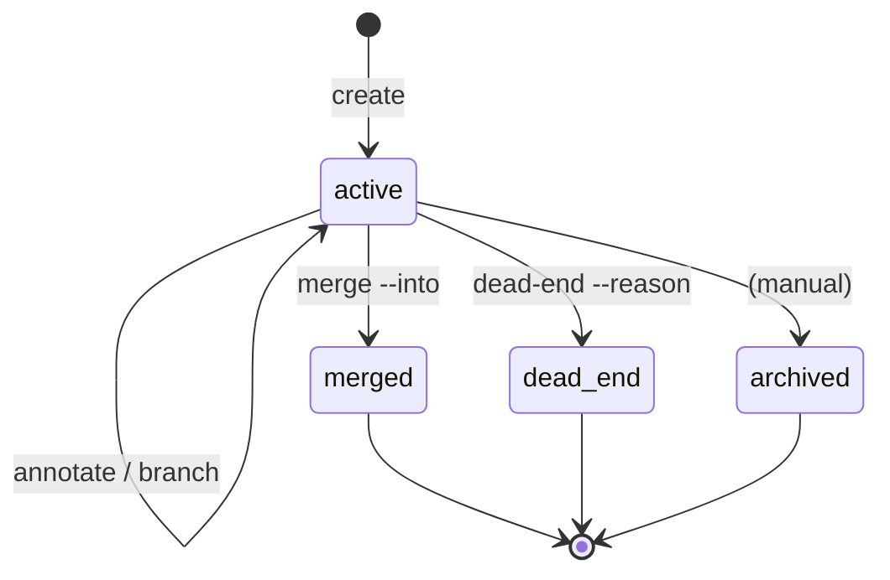

# `abc project investigation`

A research-oriented record primitive: every investigation is a
branchable, mergeable, annotateable thread of attempts. Backed by
`~/.abc/local.db` (see `docs/reference/local-state.md`).

> **Relocated 2026-05-08:** the canonical command is now
> `abc project investigation ...` (with `abc project inv ...` as a
> short alias). The root-level `abc investigation ...` is kept as a
> deprecated alias for one release; it prints a stderr note and
> forwards to the new location.

## Verbs

| Verb | Purpose |
|---|---|
| `create <title>` | Create a new investigation under the active (or `--project=`) project |
| `list` | List investigations in the active project (or `--all-projects`) |
| `show [<id>]` | Show details + runs + annotations + children |
| `use <id> | --none` | Set / clear the active investigation pointer |
| `branch <parent> <title>` | Create a child branch from a parent |
| `annotate <id> [--tag=] [--note=] [--cites=<inv>:<aid>]` | Add an annotation; opens `$EDITOR` when `--note` omitted |
| `dead-end <id> --reason=` | Mark a branch as a dead-end |
| `merge <child> --into <parent> [--note=]` | Carry annotations from child to parent and mark child merged |
| `tree [<root>]` | ASCII tree of an investigation and its branches |
| `rename <id> [--slug=] [--title=]` | Rename slug or title |
| `tag <id> --add=<tag> [--remove=<tag>]` | Add or remove tags |
| `visualize [<id>] [--type=branches|timeline|flow|lineage]` | Emit Mermaid source from local SQLite |
| `export <id> --format=ro-crate|markdown|json --output=<path>` | Export to a portable bundle |
| `diff <a> <b>` | Side-by-side comparison of two investigations |

## Auto-attach

`abc pipeline run`, `abc job run`, and `abc module run` insert a row
into the local `runs` table with `project_id` and `investigation_id`
resolved per the precedence:

1. `--no-project` / `--no-investigation` → null
2. `--project=` / `--investigation=` flag
3. `ABC_PROJECT` / `ABC_INVESTIGATION` env var
4. `active_pointers` for the current cluster context
5. null

A one-line banner is printed on every submit:

```
[abc] Auto-attached: project <slug>, investigation <slug> (run RUN-…)
```

## Visualize

`abc project investigation visualize` is a pure projection of local SQLite
into Mermaid source. It does not call any service. By default it
prints to stdout; pass `--output=<path>` to write a file, and
`--render=svg|png` to invoke `mmdc` (Mermaid CLI) when present on PATH.
`mmdc` is a SOFT dependency: if not present, the `.mmd` source is
written and a warning emitted to stderr instead of failing.

Six view types:

| `--type` | Diagram | Scope |
|---|---|---|
| `branches` (default) | gitGraph with branches and merges | single investigation |
| `timeline` | Mermaid `timeline` directive of all runs + annotations | single investigation |
| `flow` | `flowchart TD` chain of annotation/run nodes | single investigation |
| `lineage` | `flowchart LR` of investigation + citations (dotted arrows from the `citations` table) | single investigation OR project (`--project=<slug>`) |
| `kanban` | Mermaid `kanban` board, columns by status (active / merged / dead-end / archived) | project only (`--project=<slug>` required) |
| `gantt` | Mermaid `gantt` chart of investigation duration bars | single investigation (main + branches) OR project (sectioned by status) |

Flags:

- `--since=YYYY-MM-DD`
- `--branches=alive|dead|all`
- `--no-runs` (annotation-only)
- `--mermaid-version=v1|v2` (default `v1` for max renderer compat)
- `--output=<path>` — write to file
- `--render=svg|png` — invoke `mmdc` (soft dep)
- `--browser` — open the diagram on mermaid.live via the OS default browser (cross-platform: `open`/`xdg-open`/`rundll32`)

### `--browser` and mermaid.live's editor theme

The `--browser` flag opens the diagram in the mermaid.live editor with the
diagram-level theme set to `default` (light). The **editor chrome** (toolbar,
background) is controlled by mermaid.live's `mode-watcher` library which reads
only `localStorage` — there is no URL-controllable way to force the editor
chrome to light or dark. To make the chrome light persistently, click the
theme toggle once in the bottom-right of mermaid.live; the choice is stored
in `localStorage` and applies to every future `--browser` invocation in the
same browser.

## Annotation management — `abc project investigation annotation`

Annotations created with `abc project investigation annotate` are
mutable. Every edit / tag change / move / withdraw / restore writes a
row to the `annotation_revisions` table so research history is
preserved.

| Subverb | Purpose |
|---|---|
| `annotation list <inv> [--include-withdrawn] [--tag=<t>]` | List annotations on an investigation |
| `annotation show <ann-id> [--history]` | Render full annotation; `--history` walks the revision table oldest-first |
| `annotation edit <ann-id> [--note=<text>] [--reason=<text>]` | Replace body in-place; opens `$EDITOR` when `--note` omitted |
| `annotation tag <ann-id> [--add=<t>]... [--remove=<t>]... [--replace=<t1>,...]` | Mutate the tag set |
| `annotation move <ann-id> --to=<inv-id> [--reason=<text>]` | Re-target the annotation; project association follows the destination |
| `annotation withdraw <ann-id> [--reason=<text>]` | Soft-delete (sets `withdrawn_at`); `show` and `list` hide by default |
| `annotation restore <ann-id>` | Clear `withdrawn_at`; idempotent on non-withdrawn |

Withdrawn annotations are hidden from `abc project investigation show`
by default; pass `--include-withdrawn` to surface them with a marker
and the withdrawal reason.

## Investigation lifecycle

The `investigations.status` field is a small state machine:



- **active** — default on creation; can be annotated, branched from, used as
  parent for child branches.
- **merged** — set when `abc project investigation merge <child> --into <parent>`
  promotes the child's annotations into the parent. The child's annotations
  are copied (not moved) with `carried_from` set, so the merge is auditable.
- **dead-end** — set by `abc project investigation dead-end <slug> --reason=<text>`.
  The reason is preserved in `dead_end_reason` and surfaces in `branches`
  visualisation as a Mermaid comment line beneath the abandoned branch.
- **archived** — manual transition for long-finished work the user wants out
  of the default `list` view.

## Cost-per-investigation reporting

Because `runs.investigation_id` is auto-attached on every submission,
`abc report --json --by=investigation` rolls spend and emissions up
cleanly per investigation (including dead-ends — which is the point:
"how much did the failed Strelka comparison cost?"). See
[`abc report`](abc-report.md).
