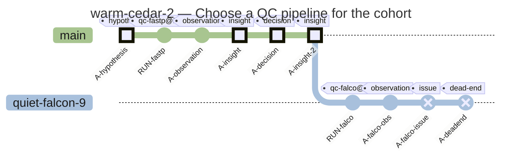
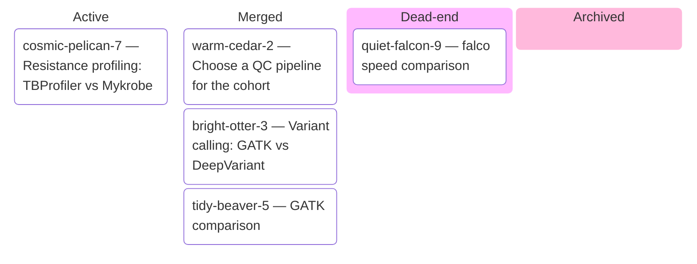
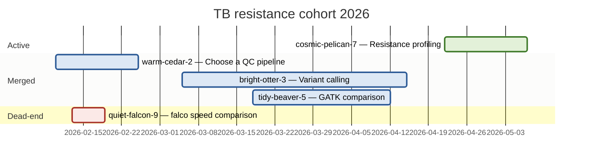
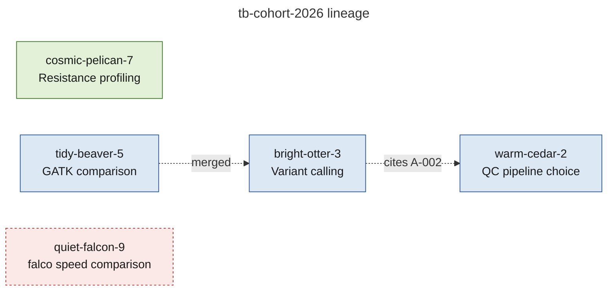
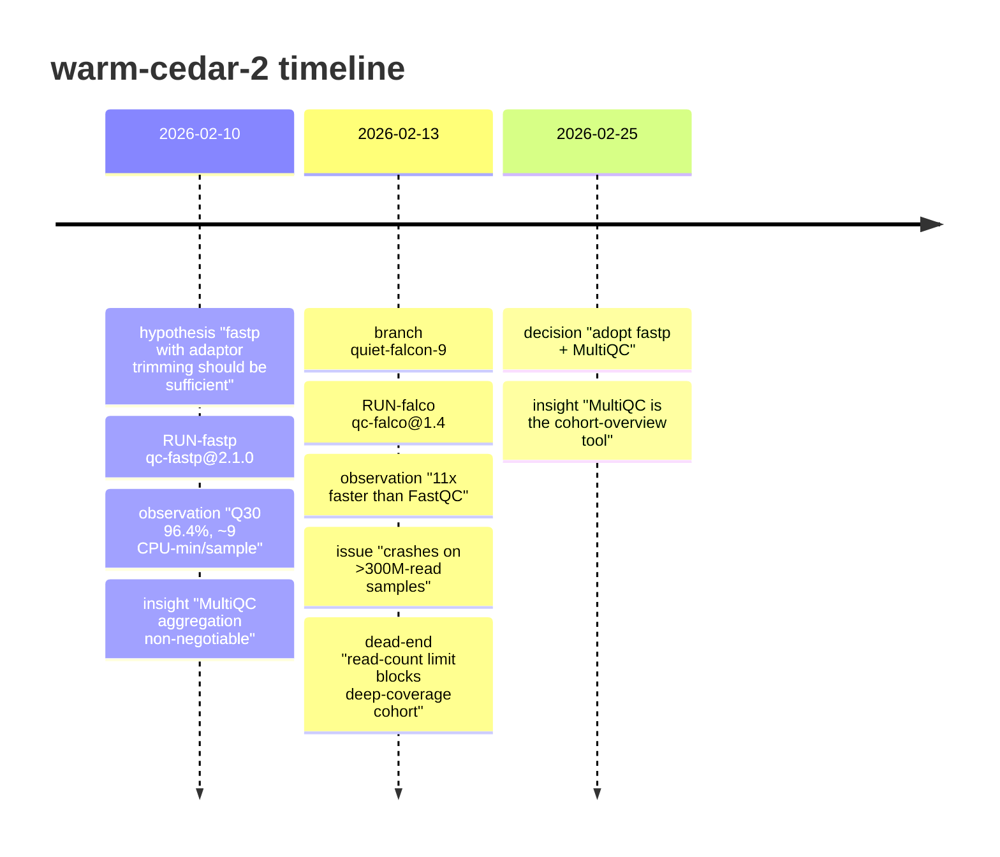
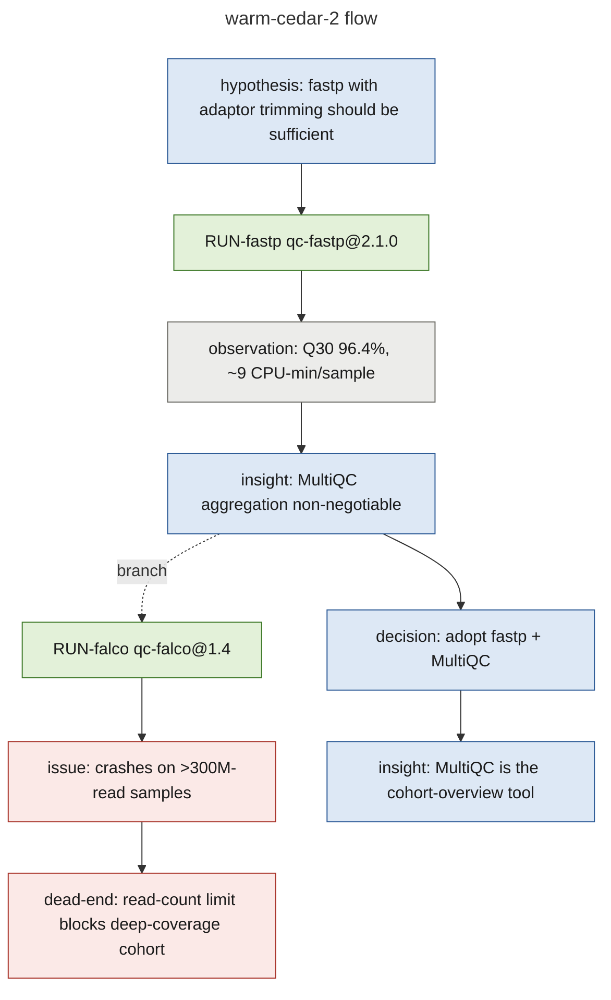
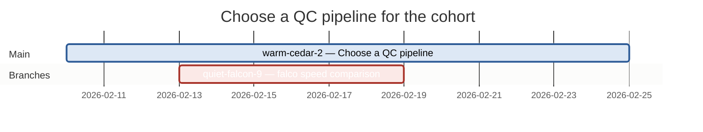
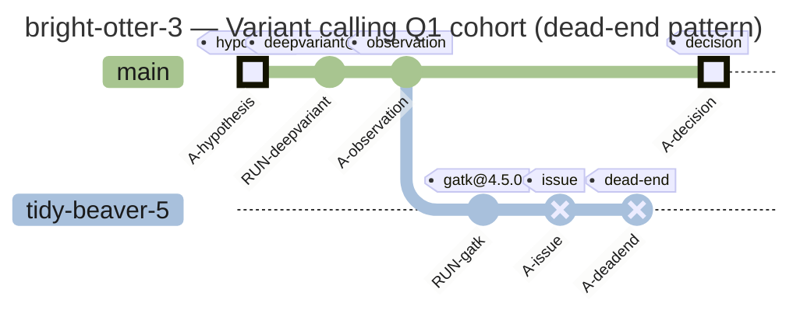
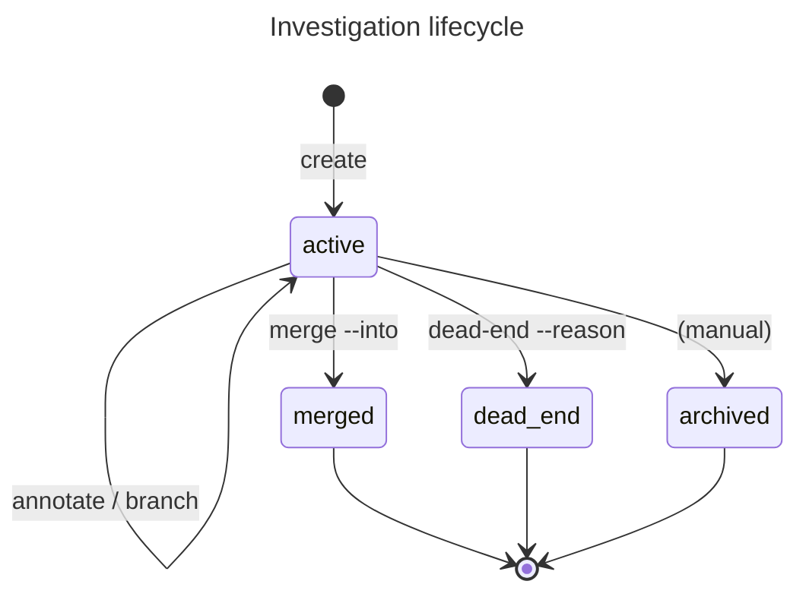

# Project management

This tutorial walks through a realistic multi-month research project using
`abc project` and `abc investigation` end-to-end. It exercises the verbs you'll
hit most often when running a real cohort study: branching for parallel
approaches, dead-ending failed attempts with reasoning preserved, citing
upstream insights, auto-attaching pipeline runs, project-level rollups for
status reviews, and exporting for methods sections.

> **Persona:** Abhi, group-admin of `bioinformatics`. Three months of work
> on a *Mycobacterium tuberculosis* cohort: QC pipeline selection → variant
> calling → resistance profiling → manuscript draft.

> **Cluster:** None required for this tutorial — every command writes to the
> local `~/.abc/local.db`. Pipeline submissions in this tutorial are
> illustrative; replace `abc pipeline run …` with `abc pipeline run … --no-submit`
> if you want to follow along without a live cluster.

## Part 1 — Set the stage (5 min)

A project is the umbrella. Everything in this tutorial lives under one project;
each investigation is a self-contained unit of inquiry.

```bash
# Adopt the right context (this is who Abhi is on the cluster)
abc auth context use bioinformatics_abhi

# Create the project
abc project create "TB resistance cohort 2026" \
  --name=tb-cohort-2026 \
  --tag=cohort \
  --tag=manuscript-target

abc project use tb-cohort-2026

# Confirm
abc project show tb-cohort-2026
```

The name `tb-cohort-2026` is now your project handle. You'll see it in the
auto-attach banner of every pipeline / job submission.

## Part 2 — Pipeline QC benchmarking with branching (15 min)

The first decision: which QC pipeline to standardise on? Abhi has three
candidates and wants to compare them.

```bash
# Start the investigation
abc project investigation create "Choose a QC pipeline for the cohort" \
  --tag=pipeline-selection
# → I-warm-cedar-2 (auto-active)

abc project investigation annotate warm-cedar-2 --tag=hypothesis \
  --note="fastp with adaptor trimming is sufficient; FastQC is older but well-established; falco claims FastQC-equivalent metrics 10x faster"

# Hypothesis 1 — try fastp on a sample of 12 samples
abc pipeline run nf-core/qc-fastp@2.1.0 \
  --input=cohort/samplesheet-pilot12.csv \
  --params=qc/fastp.json
# RUN auto-attached to warm-cedar-2
```

A few hours later the run completes. Notes go in:

```bash
abc project investigation annotate warm-cedar-2 --tag=observation \
  --note="fastp clean. Q30 fraction 96.4% across 12 samples. Adaptor content collapses cleanly. ~9 CPU-min/sample."

abc project investigation annotate warm-cedar-2 --tag=insight \
  --note="fastp's per-sample HTML is unreadable for cohort-level comparison; need MultiQC aggregation regardless of which tool wins"
```

A parallel branch to try `falco`:

```bash
abc project investigation branch warm-cedar-2 "falco speed comparison"
abc project investigation use falco-speed-comparison
# → I-quiet-falcon-9

abc pipeline run nf-core/qc-falco@1.4 --input=cohort/samplesheet-pilot12.csv

abc project investigation annotate quiet-falcon-9 --tag=observation \
  --note="falco runs 11x faster than FastQC on the same data; output format identical"

abc project investigation annotate quiet-falcon-9 --tag=issue \
  --note="falco crashes on samples with >300M reads (3 of 12 in this pilot); fastp handled them fine"

abc project investigation annotate quiet-falcon-9 --tag=dead-end \
  --note="falco's read-count limit is a blocker for our deep-coverage samples; not pursuing further"

# Mark the branch dead-end (does NOT merge back; reason is preserved)
abc project investigation dead-end quiet-falcon-9 \
  --reason="cannot handle high-coverage samples; fastp covers our use case at acceptable speed"
```

Now Abhi commits to fastp:

```bash
abc project investigation use warm-cedar-2
abc project investigation annotate warm-cedar-2 --tag=decision \
  --note="adopt fastp + MultiQC for cohort QC. Falco's read-count limit rules it out; FastQC redundant given fastp output."

abc project investigation annotate warm-cedar-2 --tag=insight \
  --note="MultiQC aggregation is non-negotiable. Tool produces single-page cohort overview that drove the decision."

abc project investigation close warm-cedar-2
```

Render to confirm what was decided:

```bash
abc project investigation visualize warm-cedar-2 --type=branches > qc-decision.mmd
```

The output (also pastable into [mermaid.live](https://mermaid.live)):



Main branch shows the fastp chain (HIGHLIGHTed decision + insight commits).
The abandoned `quiet-falcon-9` branch sits visually orphan with the
dead-end reason as a Mermaid `%%` comment.

## Part 3 — Variant calling that cites the QC insight (15 min)

Three weeks later. Abhi's running variant calling. Multiple options: GATK
HaplotypeCaller, DeepVariant, BCFtools call. He cites an insight from the QC
investigation:

```bash
abc project investigation create "Variant calling: GATK vs DeepVariant" \
  --tag=variant-calling
# → I-bright-otter-3

abc project investigation annotate bright-otter-3 --tag=hypothesis \
  --note="DeepVariant's per-sample model should outperform GATK on our coverage profile" \
  --cites=warm-cedar-2:A-002

# (the cited annotation A-002 is the fastp Q30 observation —
#  ground truth for downstream variant-call quality assessment)
```

The `--cites` flag inserts a row in the `citations` table linking this
annotation to the upstream observation. You'll see it as a dotted arrow in the
project-level lineage view later.

```bash
# DeepVariant first
abc pipeline run google/deepvariant@1.6.1 \
  --input=cohort/samplesheet-12.csv \
  --reference=reference/Mtb_H37Rv.fasta

abc project investigation annotate bright-otter-3 --tag=observation \
  --note="DeepVariant called 8431 SNPs across 12 samples. concordance with truth set 99.2%."

# Branch off to compare GATK
abc project investigation branch bright-otter-3 "GATK comparison"
abc project investigation use gatk-comparison
# → I-tidy-beaver-5

abc pipeline run broadinstitute/gatk-haplotypecaller@4.5.0 \
  --input=cohort/samplesheet-12.csv

abc project investigation annotate tidy-beaver-5 --tag=observation \
  --note="GATK called 7892 SNPs; concordance 98.7%. DeepVariant catches ~540 more variants."

abc project investigation annotate tidy-beaver-5 --tag=insight \
  --note="DeepVariant's extra calls are real (manually checked 50/540; 47 confirmed). GATK conservative on low-AF heterozygous calls."

abc project investigation merge tidy-beaver-5 --into bright-otter-3 \
  --note="DeepVariant adopted as primary; GATK retained for sanity-check parallel run"
```

Notice the merge carried `tidy-beaver-5`'s observation + insight back into
`bright-otter-3` (visible in `abc project investigation tree`).

```bash
abc project investigation use bright-otter-3
abc project investigation annotate bright-otter-3 --tag=decision \
  --note="DeepVariant primary; GATK as parallel sanity-check on every cohort run"

abc project investigation close bright-otter-3
```

## Part 4 — Resistance profiling — still active (5 min)

Two weeks later, the third investigation is in flight:

```bash
abc project investigation create "Resistance profiling: TBProfiler vs Mykrobe" \
  --tag=resistance \
  --tag=in-progress
# → I-cosmic-pelican-7

abc project investigation annotate cosmic-pelican-7 --tag=hypothesis \
  --note="TBProfiler's curated catalogue should outperform Mykrobe's k-mer approach on our XDR-enriched cohort"

abc pipeline run jodyphelan/tbprofiler@5.0.0 \
  --input=cohort/samplesheet-12.csv

abc project investigation annotate cosmic-pelican-7 --tag=observation \
  --note="TBProfiler flagged 4 XDR strains, 7 MDR, 1 pansusceptible. Result matches phenotypic DST in 11/12."

# Mykrobe still in queue — investigation stays "active"
```

This investigation is not closed. It'll keep accreting annotations and runs
until the Mykrobe leg lands.

## Part 5 — Project-level rollups (5 min)

Now the manuscript is being drafted. Abhi's supervisor wants a status review
of the whole project. Project-level views answer that:

```bash
abc project investigation visualize --project tb-cohort-2026 --type=kanban \
  > status.mmd
```



```bash
abc project investigation visualize --project tb-cohort-2026 --type=gantt \
  > timeline.mmd
```



```bash
abc project investigation visualize --project tb-cohort-2026 --type=lineage \
  > lineage.mmd
```



The lineage diagram shows the dotted citation arrow from
`bright-otter-3 → warm-cedar-2:A-002` — visual proof that the variant-calling
hypothesis was grounded in the QC observation. The merge arrow from
`tidy-beaver-5 → bright-otter-3` records that GATK was compared and the
finding rolled up to the parent investigation.

Paste any `.mmd` file into [mermaid.live](https://mermaid.live), or pop it in
the browser directly:

```bash
abc project investigation visualize --project tb-cohort-2026 --type=kanban --browser
```

Open the SVG render via `mmdc` if installed:

```bash
abc project investigation visualize --project tb-cohort-2026 --type=gantt \
  --output=timeline.svg --render=svg
```

### Cost & emissions rollup (additive)

For grant-justification or methods sections that need a cost / carbon
figure, run the closed-loop showback:

```bash
abc report --since=2026-04-01
abc report --json --by=investigation --since=2026-04-01   # per-investigation rollup
```

Spend, emissions, and hours saved come back together with a "Rate card
(effective)" provenance footer suitable for a methods appendix verbatim.
See [`abc report`](../reference/abc-report.md) for the full flag
reference and the per-metric table, including how to override
coefficients with measured values via `abc config accounting set …` and
`abc config emissions set …`.

## Part 6 — Methods section export (5 min)

Time to write the methods section. Each closed investigation can be exported:

```bash
# Markdown — drop straight into a manuscript appendix
abc project investigation export warm-cedar-2 --format=markdown \
  --output=./methods/qc-decision.md

abc project investigation export bright-otter-3 --format=markdown \
  --output=./methods/variant-calling.md

# RO-Crate — for Zenodo / WorkflowHub deposit
abc project investigation export bright-otter-3 --format=ro-crate \
  --output=./submissions/variant-calling-ro-crate.zip
```

The Markdown export has the title, status, full annotation timeline (with tags
and dates), every run with its workload reference + parameters + status, and
the merge / dead-end branch reasons. Drop the file into your manuscript
"Methods" section as-is or copy the relevant snippets.

The RO-Crate is structured for archival deposit — bundles every run's parameters,
the annotations, and the branch tree as a JSON-LD-described directory tree.

## Part 7 — Cleanup vs archival

When the project ends, you have two choices:

**Archive** — keep everything queryable, just out of the default `list` view:

```bash
abc project investigation list --project=tb-cohort-2026 \
  --status=active --output=json | jq -r '.[].name' | \
  while read s; do abc investigation tag $s --add=archived; done
```

**Delete the whole project** — purges every nested investigation + annotation +
run row:

```bash
abc project delete tb-cohort-2026
# Prompts for confirmation; cascades to everything under the project.
```

Archive is the recommended path. Even after the manuscript ships, future
"how did we choose fastp again?" questions land on the archived investigations.
Replay with `abc project investigation visualize warm-cedar-2 --type=flow` two years
later and the reasoning chain — including the Falco dead-end — comes right
back.

## Reference: all six view types

The tutorial showed `branches`, `kanban`, `gantt`, and project-level `lineage`. The
remaining two — `timeline` and `flow` — are alternate projections of the same
SQLite state. Plus a single-investigation gantt for the warm-cedar-2 branch
topology and the dead-end-branch pattern for bright-otter-3.

### `--type=timeline` (chronological)

```bash
abc project investigation visualize warm-cedar-2 --type=timeline
```



### `--type=flow` (reasoning shape)

```bash
abc project investigation visualize warm-cedar-2 --type=flow
```



### `--type=gantt` on a single investigation (Main + Branches)

```bash
abc project investigation visualize warm-cedar-2 --type=gantt
```



### `--type=branches` with a dead-end branch (no merge)

The bright-otter-3 investigation tried Strelka in parallel; it dead-ended
with the reason preserved. Renders as an orphan branch with a Mermaid
`%%` comment beneath it:

```bash
abc project investigation visualize bright-otter-3 --type=branches
```



(In the actual workflow shown earlier, `tidy-beaver-5` was the GATK
*comparison* that successfully merged. The block above shows the
dead-end pattern for completeness — substitute any failed comparison.)

### Investigation lifecycle (static reference)

The `investigations.status` field is a small state machine. Embedded
here as documentation; not generated by the CLI:



## What you've practised

| Verb | Used for |
|---|---|
| `abc project create / use / show` | Top-level grouping |
| `abc project investigation create / use` | Per-question working unit |
| `abc project investigation annotate --tag=…` | Hypothesis / observation / issue / insight / decision / dead-end notes |
| `abc project investigation annotate --cites=…` | Cross-investigation citation (becomes dotted arrow in lineage view) |
| `abc project investigation branch / merge / dead-end` | Parallel approaches, with reasons preserved |
| `abc pipeline run …` | Auto-attached to the active investigation |
| `abc project investigation visualize --type={branches\|timeline\|flow\|lineage\|kanban\|gantt}` | Six rendering modes for stakeholders, supervisors, manuscripts |
| `abc project investigation export --format={markdown\|ro-crate\|json}` | Methods sections + archival deposits |
| `abc project investigation tag / list` | Status review and lifecycle management |

## Where to go next

- The [Interacting with the cluster](./demo) walkthrough covers the rest of
  the CLI surface: `abc job run`, file uploads, encryption, contexts.
- The [`abc investigation` reference](../reference/abc-investigation) covers
  every flag and schema field.
